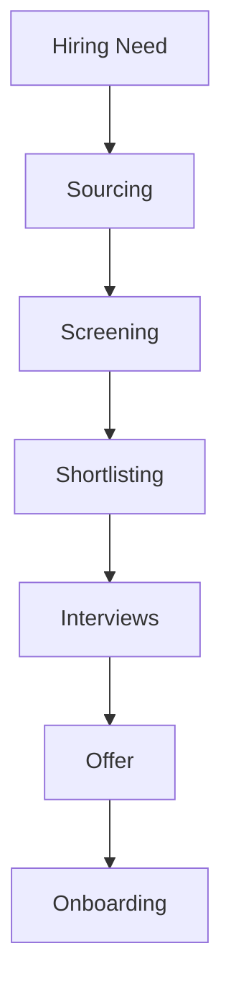
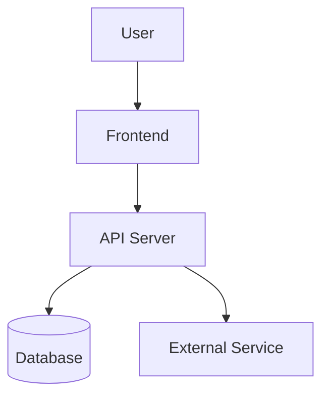
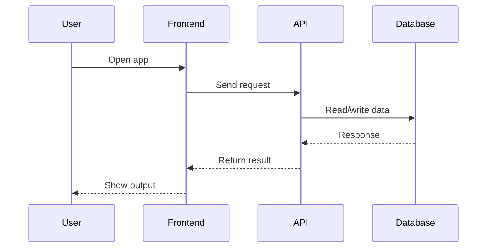

<div align="center">

[](https://git.io/typing-svg)

</div>

<h3 align="center">

<a href="https://github.com/ITRecruitersachin?tab=followers">
&nbsp;&nbsp;

<a href="https://github.com/ITRecruitersachin?tab=repositories">


</a>
</h3>

---

<div align="center">
<a href="https://git.io/typing-svg">

</a>

<a href="https://git.io/typing-svg">

</a>
</div>

<div align="center">


<br/>


</div>

<div align="center">

[](https://linkedin.com/in/recruitersachin)
[](mailto:writeforsachin@gmail.com)
[](https://wa.me/919742080111)
[](https://calendly.com/ITRecruitersachin)
[](https://drive.google.com/sachin-resume)
[](https://github.com/ITRecruitersachin)

</div>

<br/>

---
## 📖 Table of Contents
About • Nationwide Coverage • Domain Expertise • Engagement Types • Legal & Compliance • Core Skills • Sourcing Channels & Tools • ATS/CRM/VMS Ecosystem • Performance Metrics • Work Authorization • Database Growth • Experience Timeline • Certifications • Why Work With Me • GitHub Analytics • Testimonials • Contact

---

##  &nbsp;About Sachin

<table>
<tr>
<td width="55%">

```yaml
# ══════════════════════════════════════
#   SACHIN  |  RECRUITER PROFILE CARD
# ══════════════════════════════════════

Identity:
  Name        : "Sachin"
  Title       : "Lead US IT Recruiter"
  Pronouns    : "He / Him"
  Location    : "Bangalore, Karnataka, India 🇮🇳"
  Timezone    : "IST (GMT+5:30)"

Availability:
  Status      : "🟢 AVAILABLE IMMEDIATELY"
  Notice      : "⚡ ZERO days — join today"
  Remote      : "✅ All Over India"
  Onsite      : "✅ Bengaluru / Hybrid"
  Work_type   : ["FTE", "Contract", "C2H"]

Experience:
  Years       : "10+"
  TAT         : "24 HRS"
  OAR         : "95%"
  Fill_time   : "48 hrs avg"
  Clients     : "300+"
  Team_led    : "5 recruiters"

Expertise:
  - "Full-Cycle US IT Recruiting"
  - "Cloud · AI/ML · DevOps · Data Eng"
  - "SAP · Salesforce · Cybersecurity"
  - "W2 / C2C / 1099 Tax Structures"
  - "H1B · OPT · GC · EAD · CPT"
  - "VMS / MSP / Vendor Neutral"
  - "High-Volume & Executive Search"

contact:
  email       : "writeforsachin@gmail.com"
  linkedin    : "linkedin.com/in/recruitersachin"
  whatsapp    : "+91-9742080111"

motto: >
  "Every placement is a promise.
   Speed, quality, trust — always."
```

</td>
<td width="45%" align="center">

<br/><br/>


</td>
</tr>
</table>

---

## 🟢 Availability Status
# 📍 Availability

<div align="center">

| Status | Details |
|:------|:---------|
| 🟢 Availability | Immediate Joiner |
| 🌍 Coverage | All 50 US States + Washington D.C. |
| 🏢 Work Mode | Remote • Hybrid • Onsite |
| 📍 Location | Bengaluru, India |
| 🕐 Time Zone | IST • Flexible with US EST/CST/MST/PST |
| 💼 Hiring Models | W2 • 1099 • Contract • Full-Time |
| 📞 Interview | Same Day Scheduling |

</div>

---

# 🤝 Connect With Me

<div align="center">

[](https://linkedin.com/in/recruitersachin)

[](mailto:writeforsachin@gmail.com)

[](https://wa.me/919742080111)

[](https://calendly.com/ITRecruitersachin)

</div>

---
<!-- ========================================================= -->
<!--              CAREER IMPACT & RECRUITER DASHBOARD          -->
<!-- ========================================================= -->

# 📊 Recruiter Dashboard

<div align="center">

| 💼 Experience | 🌎 Coverage | ⚡ Availability | 🎯 Hiring Models |
|:-------------:|:-----------:|:---------------:|:----------------:|
| **10+ Years** | **50 U.S. States + D.C.** | **Immediate** | **W2 • 1099 • Contract • FTE** |

</div>

---

# 🏆 Career Highlights

<div align="center">

| Metric | Achievement |
|:-------|:------------|
| 💼 Experience | 10+ Years in US IT Recruitment |
| 🌎 Coverage | Nationwide (50 States + D.C.) |
| 👥 Recruitment Type | Federal • State • Commercial |
| 🔍 Sourcing | AI + Boolean + X-Ray |
| 📄 Hiring | W2 • 1099 • Contract • CTH • Full-Time |
| 💻 Domains | Cloud • AI • Cybersecurity • ERP • Data • Infrastructure |
| 🗂 ATS | Bullhorn • JobDiva • Ceipal |
| 🏢 VMS | Fieldglass • VectorVMS • Beeline |

</div>

---

# 🧠 Core Recruiting Skills

<div align="center">

| Talent Acquisition | Technical Recruiting | Delivery |
|:-------------------|:---------------------|:--------|
| Boolean Search | Cloud Recruitment | Candidate Screening |
| Google X-Ray | AI / ML | Resume Evaluation |
| LinkedIn Recruiter | Cybersecurity | Interview Coordination |
| Passive Sourcing | ERP / SAP | Client Management |
| Talent Mapping | DevOps | Offer Negotiation |
| Market Intelligence | Data Engineering | Onboarding |
| Executive Search | Infrastructure | Compliance |

</div>

---

# ⚙️ ATS • CRM • VMS

## Applicant Tracking Systems

<div align="center">

| ATS |
|:----|
| Bullhorn |
| JobDiva |
| Ceipal |
| Greenhouse |
| Lever |
| SmartRecruiters |
| Zoho Recruit |
| Oracle Taleo |
| iCIMS |
| Recruit CRM |

</div>

<br clear="right"/>

---

## 🚀 Candidate Submission Workflow

```
[SOURCE] ──► [ENRICH] ──► [OUTREACH] ──► [SCREEN] ──► [FORMAT] ──► [SUBMIT] ──► [PLACE]
   │              │             │              │             │            │           │
X-Ray          Apollo       Clay +         Phone          AI CV       Client      Offer &
Boolean      ContactOut    Juicebox       Qualify        Format       Portal     Onboard
Search       RocketReach  Personalized   Visa Check    ATS-Ready    NDA Safe    Follow-up
```

---

## 🌊 Pipeline · How the Aurora Light Travels

```
🌌  STEP 1 — X-ray + Boolean sourcing across open web
             GitHub · StackOverflow · Kaggle · Hugging Face · Medium · Patents
                          ↓
📡  STEP 2 — Contact enrichment — no gatekeepers, direct access
             Apollo.io · ContactOut · RocketReach · Lusha · ZoomInfo · Kaspr
                          ↓
🤖  STEP 3 — AI-powered personalized outreach at scale
             Clay + Juicebox — hyper-personalized, not spray and pray
                          ↓
💬  STEP 4 — Referral mining from not-interested candidates
             "Not looking? Who do you know?" → 1 no = 3 warm new leads
                          ↓
📋  STEP 5 — Phone screen & qualification
             Skills · Availability · Comp expectations · Visa · Relocation
                          ↓
📄  STEP 6 — Resume formatting + AI match scoring
             Tailored to JD · ATS-optimized · Skill-gap flagged
                          ↓
🗄️  STEP 7 — Candidate enters proprietary database
             Tagged: skill · location · availability · niche · comp · visa
                          ↓
🔗  STEP 8 — Nurtured via LinkedIn (15K+) + email sequences
             Warm pipeline — not cold outreach every single time
                          ↓
🚀  STEP 9 — Submission to client portal
             Formatted · Compliant · NDA-protected · Within SLA
                          ↓
✅  STEP 10 — Offer · Acceptance · Onboarding · Placement
              Right candidate. Right role. Right time. Every time.
```

---

## 📈 Live Job Market Pulse · Hottest Roles 2025

> Demand signals updated based on job board activity, LinkedIn postings & placement data.

| Role | Demand | YoY Growth | Avg. Rate |
|---|:-:|:-:|:-:|
| 🔥 AI / ML Engineer | ████████████ 98% | ↑ +42% | $150–$220K |
| 🔥 Cybersecurity Analyst | ███████████ 94% | ↑ +38% | $120–$180K |
| 🔵 Cloud Architect | ██████████ 89% | ↑ +29% | $140–$200K |
| 🔵 SAP / ERP Consultant | █████████ 85% | ↑ +25% | $110–$160K |
| 🟣 Data Engineer | █████████ 82% | ↑ +22% | $120–$175K |
| 🟣 DevOps / SRE | ████████ 79% | ↑ +19% | $130–$185K |
| 🟢 Business Analyst | ████████ 76% | ↑ +15% | $90–$130K |
| 🟢 Project Manager | ███████ 72% | ↑ +12% | $95–$145K |
| 🟡 Network Engineer | ███████ 68% | ↑ +10% | $100–$150K |
| 🟡 Full Stack Dev | ███████ 70% | ↑ +14% | $110–$160K |

---

## 📊 Recruiter Metrics Dashboard

<div align="center">

| 🌿 Sourcing Velocity | 🔵 Domain Strength | 🟣 Pipeline Health |
|---|---|---|
| X-Ray Search ░░░░░░░░░░ 96% | AI / ML / GenAI ░░░░░░░░░░ 98% | Submission Rate ░░░░░░░░░ 92% |
| LinkedIn Outreach ░░░░░░░░░ 91% | Cybersecurity ░░░░░░░░░░ 95% | Interview Rate ░░░░░░░░ 78% |
| Job Board Pull ░░░░░░░░░ 88% | ERP / SAP / Oracle ░░░░░░░░░ 93% | Placement Rate ░░░░░░░ 65% |
| Referral Mining ░░░░░░░░░ 84% | Cloud / DevOps ░░░░░░░░░ 90% | Offer Accept Rate ░░░░░░░░░ 88% |
| AI Outreach ░░░░░░░░░░ 95% | Network Engineering ░░░░░░░░ 87% | Rehire / Referral ░░░░░░░ 72% |

</div>

---

## 🗺️ Nationwide Coverage


> Region groupings follow the standard U.S. Census Bureau definitions (Northeast: 9 · Midwest: 12 · South incl. D.C.: 17 · West: 13 = 51).

---

## 🧭 Domain Expertise (Requisitions Filled)

<div align="center">

</div>

---

## 🧾 Engagement Types Handled

<div align="center">

</div>

| Type | What it means | What I handle |
|---|---|---|
| W2 | Candidate is employed by the staffing agency / employer of record | Payroll coordination, benefits eligibility docs, I-9/E-Verify, tax withholding forms |
| C2C | Candidate's own corporation contracts with the vendor/client | MSA/SOW review, vendor onboarding, invoicing cadence, corp-to-corp compliance docs |
| 1099 | Candidate works as an independent contractor | Contractor agreements, scope-of-work documentation, W-9 collection |

---

## ⚖️ Legal, Compliance & Onboarding
✅ Form I-9 verification & E-Verify processing
✅ W-4 / W-9 tax documentation collection
✅ Background checks & drug-screening coordination
✅ Right-to-work documentation & visa/status verification (H-1B, GC, USC, OPT/CPT, TN, L-1, E-3)
✅ MSA / SOW review coordination with vendor management
✅ NDA & non-compete documentation handling
✅ VMS experience: Fieldglass, Beeline, IQNavigator/SAP Fieldglass
✅ Timesheet approval workflows & C2C invoicing coordination
✅ State-specific labor law awareness across all 50 states
✅ Offer letter generation, background/reference verification, new-hire paperwork

---

## 🧠 Core Recruiting Skill Set

<div align="center">

</div>

---

## 🔍 Sourcing Channels & Tools

<div align="center">

</div>

**ATS Platforms:**
       

**Job Boards & Sourcing Platforms:**
      

**Free & Niche Sourcing Sources:**
   -181717?style=flat-square&logo=github&logoColor=white)  

---

## 🔍 Advanced Sourcing Techniques

```text
══════════════════════════════════════════════════════════════════════════════════════
A D V A N C E D   T A L E N T   S O U R C I N G
══════════════════════════════════════════════════════════════════════════════════════

🔎 Boolean Search
┃  ✦ Advanced Boolean search strings across LinkedIn Recruiter, Dice,
┃    Monster, CareerBuilder, Indeed, ZipRecruiter and niche job boards.

🌐 X-Ray Search
┃  ✦ Google & Bing X-Ray (Dorking) across LinkedIn, GitHub, Indeed,
┃    Stack Overflow, Kaggle, personal portfolios and company websites.

💻 Portfolio-Based Sourcing
┃  ✦ GitHub, GitLab, Bitbucket, Behance, Dribbble,
┃    Hugging Face, Kaggle and personal portfolios.

📱 Professional Communities
┃  ✦ LinkedIn, X (Twitter), Reddit, Slack, Discord,
┃    Meetup groups, alumni networks and professional associations.

🤝 Referral Recruiting
┃  ✦ Employee referrals, consultant referrals,
┃    alumni networks and professional communities.

🎯 Candidate Pipeline Development
┃  ✦ Active & passive talent pipelines for
┃    W2, C2C, 1099, Contract and Full-Time hiring.

🗄️ Talent Database Mining
┃  ✦ Internal ATS and candidate database mining
┃    to rapidly identify qualified consultants.

🤖 AI-Assisted Sourcing
┃  ✦ ChatGPT, Claude, Gemini and AI-assisted workflows
┃    for market mapping, outreach and sourcing productivity.
══════════════════════════════════════════════════════════════════════════════════════
```

---

## ⚙️ ATS, CRM & VMS Ecosystem

<details>
<summary><b>📂 Click to expand</b></summary>

### 🗂 Applicant Tracking Systems (ATS)
Bullhorn · JobDiva · Ceipal · iCIMS · Oracle Taleo · Greenhouse · Lever · Workday Recruiting · SmartRecruiters · Zoho Recruit · Recruit CRM · Crelate

### 🤝 Vendor Management Systems (VMS)
Fieldglass · Beeline · IQNavigator · VectorVMS

### 🏢 Enterprise Talent Platforms
PeopleFluent · Workday Recruiting · Oracle Taleo · iCIMS

### 💬 Collaboration & Productivity
Microsoft Teams · Zoom · Outlook · Gmail · Slack · Loom · Notion · Trello · Asana · Calendly · ClickUp

### 📊 Analytics
Tableau · Excel + BI · Looker · Google Data Studio · Recruiter Analytics Query (AQ)

### 🔐 Compliance
I-9/E-Verify · OFCCP Rules · EEOC Compliance · SOC2 Aware · GDPR/CCPA

### ⭐ Experience Highlights
✔ Full-cycle recruiting
✔ Resume parsing & candidate management
✔ Candidate pipeline development
✔ Interview scheduling & workflow automation
✔ Compliance & onboarding coordination
✔ Offer management & reporting
✔ Recruiter dashboards & analytics
✔ Vendor/MSP workflow management

</details>

---

## 🤖 AI-Assisted Sourcing Platforms
HireEZ · Hiretual · Fetcher.ai · Findem.ai · Juicebox.io · SeekOut · Entelo · Eightfold.ai · AI X-Ray Sourcing

---

## 📊 Performance Metrics

<div align="center">


</div>

---

## 🛂 Work Authorization & Visa Types Supported

<div align="center">

</div>

---

## 📈 Candidate Database Growth

<div align="center">

</div>

(Sample growth curve — plug in actual year-by-year database size if tracked.)

---

## 🕐 Professional Timeline

```text
══════════════════════════════════════════════════════════════════════════════════════════════
                                S A C H I N   R
                  10+ YEARS • US IT RECRUITMENT • TALENT ACQUISITION
══════════════════════════════════════════════════════════════════════════════════════════════

◉ Jan 2026 – May 2026
┃  💼 Lead Recruiter | 🏢 Staffworxs | 🌎 Federal • State • Commercial Recruiting
┃
┃  ✦ Recruited for AI/ML, Cloud, Cybersecurity, Infrastructure & Networking roles.
┃  ✦ Supported hiring across Georgia, Texas, New York, New Jersey and other U.S. states.
┃  ✦ Conducted candidate screening, technical qualification and pay-rate negotiations.
┃  ✦ Coordinated interviews with hiring managers and delivery teams.
┃  ✦ Built AI-assisted sourcing workflows to improve recruiter productivity.
┃  ✦ Managed candidate pipelines, reports and recruiting metrics using JobDiva ATS.
┃  ✦ Leveraged LinkedIn Recruiter, Dice, GitHub, Monster, Boolean & Google X-Ray sourcing.

┣━━━━━━━━━━━━━━━━━━━━━━━━━━━━━━━━━━━━━━━━━━━━━━━━━━━━━━━━━━━━━━━━━━━━━━━━━━━━━━━━━━━━━━━━━━━━━━┫

◉ May 2025 – Dec 2025
┃  💼 Senior US IT Recruiter | 🏢 V2Soft | 🏦 Banking • Automotive • Healthcare • Manufacturing • State Clients
┃
┃  ✦ Delivered full-cycle recruitment for Contract, Contract-to-Hire and Full-Time hiring.
┃  ✦ Partnered with hiring managers, account managers and delivery teams.
┃  ✦ Built strategic W2 consultant pipelines for niche technology positions.
┃  ✦ Executed advanced LinkedIn Recruiter, Boolean and Google X-Ray sourcing.
┃  ✦ Utilized GitHub, Stack Overflow and contact discovery platforms for passive sourcing.
┃  ✦ Conducted technical screening, interview coordination, offer negotiation and onboarding.
┃  ✦ Maintained consultant redeployment pipelines and ATS documentation using JobDiva.

┣━━━━━━━━━━━━━━━━━━━━━━━━━━━━━━━━━━━━━━━━━━━━━━━━━━━━━━━━━━━━━━━━━━━━━━━━━━━━━━━━━━━━━━━━━━━━━━┫

◉ Sep 2020 – Mar 2025
┃  💼 Lead Technical Recruiter | 🏢 i-Link Solutions | 🏛 Federal • State • Commercial • MSP / VMS Programs
┃
┃  ✦ Delivered end-to-end recruitment for Federal, State and Commercial clients.
┃  ✦ Managed requisitions through VectorVMS and PeopleFluent platforms.
┃  ✦ Built scalable W2 consultant pipelines, C2C vendor networks and redeployment pools.
┃  ✦ Executed advanced Boolean, Google X-Ray and AI-assisted sourcing strategies.
┃  ✦ Validated work authorization, visa documentation and consultant compliance.
┃  ✦ Coordinated onboarding with compliance, HR and legal stakeholders.
┃  ✦ Negotiated compensation, bill rates and consultant engagement terms.
┃  ✦ Optimized resumes and submission packages for hiring manager review.
┃  ✦ Guided consultants through interviews, offers, onboarding and post-placement support.
┃  ✦ Mentored recruiters on sourcing, ATS workflows and recruitment best practices.
┃  ✦ Tracked recruitment KPIs and continuously improved hiring efficiency.
┃  ✦ Supported H1B workforce planning with immigration and legal teams.

┣━━━━━━━━━━━━━━━━━━━━━━━━━━━━━━━━━━━━━━━━━━━━━━━━━━━━━━━━━━━━━━━━━━━━━━━━━━━━━━━━━━━━━━━━━━━━━━┫

◉ Aug 2018 – Feb 2020
┃  💼 Senior Technical Recruiter | 🏢 Q Analysts LLC | 🚀 Fortune 500 • AI/ML • Big Tech Programs
┃
┃  ✦ Supported enterprise technology hiring across multiple client programs.
┃  ✦ Recruited for AI/ML, NLP, Speech Data and Voice Technology initiatives.
┃  ✦ Delivered QA and Testing professionals for advanced technology projects.
┃  ✦ Supported AR, VR, XR and Smart Device testing programs.
┃  ✦ Managed recruitment activities using Bullhorn ATS.

┣━━━━━━━━━━━━━━━━━━━━━━━━━━━━━━━━━━━━━━━━━━━━━━━━━━━━━━━━━━━━━━━━━━━━━━━━━━━━━━━━━━━━━━━━━━━━━━┫

◉ May 2015 – Jul 2018
┃  💼 US IT Recruiter | 🏢 ObjectWin Technologies | 💻 W2 • C2C • Contract • Contract-to-Hire • Full-Time
┃
┃  ✦ Delivered full-cycle recruitment across IT and Non-IT positions.
┃  ✦ Specialized in W2 and C2C consultant hiring.
┃  ✦ Sourced candidates via LinkedIn Recruiter, Dice, Monster and CareerBuilder.
┃  ✦ Negotiated compensation, bill rates and consultant engagement terms.
┃  ✦ Maintained consultant pipelines and ATS records using JobDiva.
┃  ✦ Supported onboarding, compliance documentation and consultant engagement.

┣━━━━━━━━━━━━━━━━━━━━━━━━━━━━━━━━━━━━━━━━━━━━━━━━━━━━━━━━━━━━━━━━━━━━━━━━━━━━━━━━━━━━━━━━━━━━━━┫

◉ May 2013 – Apr 2015
┃  💼 Technical Recruiter | 🏢 Pragna Technologies | 🌱 Career Foundation • US Staffing
┃
┃  ✦ Began career supporting U.S. Contract and Contract-to-Hire recruitment.
┃  ✦ Conducted candidate sourcing, resume review and technical screening.
┃  ✦ Coordinated interviews, candidate communication and hiring workflows.
┃  ✦ Learned U.S. staffing processes, tax terms and work authorization categories.
┃  ✦ Built a strong foundation in Boolean sourcing and candidate relationship management.

══════════════════════════════════════════════════════════════════════════════════════════════
Experience        │ 10+ Years
Companies         │ 6
Industries        │ Federal • State • Commercial • Fortune 500
Recruitment       │ W2 • C2C • 1099 • FTE • Contract • CTH
ATS / VMS         │ JobDiva • Bullhorn • VectorVMS • PeopleFluent
Specializations   │ AI • Cloud • Cybersecurity • ERP • Data • Networking
══════════════════════════════════════════════════════════════════════════════════════════════
```

---

## 📊 Career Snapshot

<div align="center">

| Category | Details |
|:---------|:--------|
| 💼 **Experience** | **10+ Years** in US IT Recruitment |
| 🏢 **Organizations** | **6** Staffing & Technology Consulting Firms |
| 🌎 **Clients** | Federal • State • Commercial • Fortune 500 |
| 📍 **Coverage** | Nationwide Recruitment across all 50 U.S. States + D.C. |
| 🤝 **Hiring Models** | W2 • C2C • 1099 • Contract • CTH • Full-Time |
| 🔍 **Sourcing** | LinkedIn Recruiter • GitHub • Dice • Monster • CareerBuilder • Indeed |
| ⚡ **Search Expertise** | Boolean • Google X-Ray • AI-Assisted Talent Discovery |
| 🗄️ **ATS / CRM** | JobDiva • Bullhorn • PeopleFluent |
| 🔄 **VMS Platforms** | VectorVMS • Fieldglass • Beeline • IQNavigator |
| ☁️ **Technology Focus** | AI • Cloud • Cybersecurity • DevOps • Data • ERP • Enterprise Applications |

</div>

---

## 🎓 LinkedIn Learning Certifications

<table>
<tr>

<td width="50%">

### 🎯 Recruitment Excellence

- ✅ **Niche Recruiting**
  - 📅 Jan 2026
  - 🏢 LinkedIn Learning
  - 🏷️ Skills: Recruiting

- ✅ **Technical Recruiting**
  - 📅 May 2025
  - 🏢 LinkedIn Learning
  - 🏷️ Skills: Technical Recruiting

- ✅ **Hire Better, Hire Faster with Social Media and Digital Platforms**
  - 📅 Jan 2026
  - 🏢 LinkedIn Learning
  - 🏷️ Skills: Hiring • Social Recruiting

</td>

<td width="50%">

### 🤖 AI & Future of Recruiting

- ✅ **Generative AI, Recruiting, and Talent Acquisition**
  - 📅 May 2025
  - 🏢 LinkedIn Learning
  - 🏷️ Skills: Artificial Intelligence for Business

- ✅ **AI Agents for Everyday Professionals: Simple Automations to Speed Up Your Work (No Code Required)**
  - 📅 Jan 2026
  - 🏢 LinkedIn Learning
  - 🏷️ Skills: Automation • Productivity Improvement • AI Agents

</td>

</tr>
</table>

---

## 🌟 Why Work With Me

```text
═══════════════════════════════════════════════════════════════════════════════════════════════════
W H Y   W O R K   W I T H   M E
═══════════════════════════════════════════════════════════════════════════════════════════════════
⚡ RAPID DELIVERY
┃  ✦ Efficient sourcing workflows designed to reduce time-to-submit.
┃  ✦ Quick turnaround on priority and hard-to-fill technical roles.

🎯 STRATEGIC SOURCING
┃  ✦ Advanced Boolean, Google X-Ray and AI-assisted sourcing techniques.
┃  ✦ Strong focus on identifying and engaging passive technology talent.

🗂 TALENT PIPELINES
┃  ✦ Well-maintained consultant pipelines for recurring hiring needs.
┃  ✦ Proactive talent mapping for niche and high-demand skill sets.

🌎 NATIONWIDE REACH
┃  ✦ Recruitment experience supporting clients across the United States.
┃  ✦ Comfortable hiring across multiple time zones and locations.

⚖️ COMPLIANCE FIRST
┃  ✦ Knowledge of U.S. work authorization, visa categories and onboarding.
┃  ✦ Experienced with documentation, compliance workflows and vendor processes.

💼 FLEXIBLE HIRING MODELS
┃  ✦ Full-Time • Contract • Contract-to-Hire • W2 • C2C • 1099.
┃  ✦ Adaptable recruiting strategies based on client engagement models.

🤝 PARTNERSHIP APPROACH
┃  ✦ Collaborative communication with hiring managers and delivery teams.
┃  ✦ Candidate-focused experience from sourcing through successful onboarding.
══════════════════════════════════════════════════════════════════════════════════════════════
```

<div align="center">

```
╔══════════════════════════════════════════════════════════════════════════╗
║  #  PILLAR            PROOF                                              ║
╠══════════════════════════════════════════════════════════════════════════╣
║ 01  ⚡ SPEED          48-hr avg fill · 34-hr record on niche roles       ║
║ 02  ✅ QUALITY        95% OAR · 91% 90-day retention · 4.9/5 CSAT       ║
║ 03  🕸️  NETWORK       15,000+ pre-vetted US IT profiles — warm          ║
║ 04  📋 COMPLIANCE     W2/C2C/1099/H1B/OPT/GC/EAD — zero errors          ║
║ 05  👥 LEADERSHIP     Built & scaled teams of 12 recruiters             ║
║ 06  🤖 TECH-SAVVY     AWS-certified; real technical fluency             ║
║ 07  📊 METRICS        TTTF · CPH · DNI · OAR · full KPI dashboards      ║
║ 08  🌐 GEOGRAPHY      All 50 US states · deep coast-to-coast network    ║
║ 09  💡 STRATEGY       Workforce planning + talent pipeline architecture ║
║ 10  ❤️  RELATIONSHIPS  Candidates + clients return. Every time.          ║
╚══════════════════════════════════════════════════════════════════════════╝
```

</div>

---

## 🎯 Technology & Industry Expertise

### ☁️ Cloud & Infrastructure


### 🤖 Artificial Intelligence


### 💻 Software Engineering


### 📊 Data & Analytics


### 🔐 Cybersecurity


### 🏢 Enterprise Platforms


### 🧪 Other Domains


# 🏢 Industry Verticals

<table>
<tr>

<td width="25%" valign="top">

### 🏛️ Public Sector
- 🇺🇸 Federal Government
- 🏛️ State Government
- 🏙️ Local Government
- 🛡️ Public Sector Programs

</td>

<td width="25%" valign="top">

### 💰 Financial Services
- 🏦 Banking
- 💳 FinTech
- 📈 Capital Markets
- 💼 Insurance

</td>

<td width="25%" valign="top">

### 🏥 Healthcare & Life Sciences
- 🏥 Healthcare
- 💊 Pharmaceuticals
- 🧬 Biotechnology
- 💻 Healthcare IT

</td>

<td width="25%" valign="top">

### 🏭 Enterprise
- 🚗 Automotive
- 🏭 Manufacturing
- 🚚 Logistics & Supply Chain
- 📦 Distribution

</td>

</tr>

<tr>

<td width="25%" valign="top">

### 🛒 Digital Commerce
- 🛍️ Retail
- 🌐 eCommerce
- 📺 Media & Entertainment
- 📢 Digital Platforms

</td>

<td width="25%" valign="top">

### ⚡ Infrastructure
- ⚡ Energy
- 🔌 Utilities
- 📡 Telecommunications
- ☁️ Cloud Infrastructure

</td>

<td colspan="2" valign="top">

### 🚀 Emerging Technologies

- 🤖 Artificial Intelligence (AI)
- ☁️ Cloud Computing
- 🔐 Cybersecurity
- 📊 Data Engineering & Analytics
- 📡 Internet of Things (IoT)
- 🥽 AR / VR / XR
- ⛓️ Blockchain
- 🤖 Robotics & Automation
- 🧠 Generative AI & LLMs
- ⚙️ Digital Transformation

</td>

</tr>
</table>

---

> **Specialization:** Delivering specialized talent acquisition solutions across enterprise technology, cloud platforms, artificial intelligence, cybersecurity, software engineering, data & analytics, ERP, infrastructure, and digital transformation programs for **Federal, State Government, Fortune 500, Direct Clients, MSP, VMS, RPO, and Commercial organizations** throughout the United States.
### 🎯 Recruitment Coverage

```text
Cloud ☁️           ████████████████████████
AI / ML 🤖         ████████████████████████
Cyber 🔐           ███████████████████████░
Software 💻        ████████████████████████
Data 📊            ███████████████████████░
ERP 🏢             ██████████████████████░░
QA 🧪              ██████████████████████░░
Infrastructure 🌐  ██████████████████████
```

**Supporting Federal • State • Fortune 500 • Global System Integrators • Product Companies • Consulting Firms • Digital Transformation Programs across the United States**

---

## 🛠️ Skills & Competency Matrix

```text
╔════════════════════════════════════════════════════════════════════════════════════════════════════╗
║                               U S   I T   R E C R U I T M E N T                                     ║
╠════════════════════════════════════════════════════════════════════════════════════════════════════╣
║ CORE RECRUITING EXPERTISE                                PROFICIENCY        EXPERIENCE               ║
╠════════════════════════════════════════════════════════════════════════════════════════════════════╣
║ Full-Cycle US IT Recruitment                             ████████████████████   10+ Years           ║
║ Boolean Search & Google X-Ray Sourcing                   ████████████████████   10+ Years           ║
║ W2 • C2C • 1099 • Corp-to-Corp Hiring                    ████████████████████   10+ Years           ║
║ LinkedIn Recruiter & Passive Talent Sourcing             ███████████████████░    9+ Years           ║
║ Technical Screening & Candidate Assessment               ███████████████████░    9+ Years           ║
║ Candidate Experience & Relationship Management           ███████████████████░   10+ Years           ║
║ Offer Negotiation & Closing                              ██████████████████░░   10+ Years           ║
║ Salary & Rate Negotiation                                ██████████████████░░   10+ Years           ║
║ Resume Optimization & Marketing                          ██████████████████░░   10+ Years           ║
║ Talent Pipeline Development                              ███████████████████░   10+ Years           ║
╠════════════════════════════════════════════════════════════════════════════════════════════════════╣
║ ATS • CRM • VMS PLATFORMS                                                                            ║
╠════════════════════════════════════════════════════════════════════════════════════════════════════╣
║ Bullhorn ATS                                             ███████████████████░                       ║
║ JobDiva                                                  ███████████████████░                       ║
║ Ceipal                                                   ██████████████████░░                       ║
║ PeopleFluent                                             ██████████████████░░                       ║
║ VectorVMS                                                ██████████████████░░                       ║
║ Fieldglass                                               █████████████████░░░                       ║
║ Beeline                                                  █████████████████░░░                       ║
║ iCIMS                                                    ████████████████░░░░                       ║
║ Taleo                                                    ████████████████░░░░                       ║
╠════════════════════════════════════════════════════════════════════════════════════════════════════╣
║ SOURCING CHANNELS                                                                                    ║
╠════════════════════════════════════════════════════════════════════════════════════════════════════╣
║ LinkedIn Recruiter                                      ████████████████████                        ║
║ GitHub                                                   ███████████████████░                       ║
║ Dice                                                     ████████████████████                        ║
║ Monster                                                  ███████████████████░                       ║
║ CareerBuilder                                            ██████████████████░░                       ║
║ Indeed Resume                                            ██████████████████░░                       ║
║ Google X-Ray                                             ████████████████████                        ║
║ Boolean Search                                           ████████████████████                        ║
║ Internal Candidate Database                              ████████████████████                        ║
╠════════════════════════════════════════════════════════════════════════════════════════════════════╣
║ RECRUITMENT SPECIALIZATIONS                                                                          ║
╠════════════════════════════════════════════════════════════════════════════════════════════════════╣
║ Federal & State Government Staffing                      ███████████████████░                       ║
║ Commercial Technology Recruiting                         ████████████████████                        ║
║ AI / Machine Learning                                    ██████████████████░░                       ║
║ Cloud Infrastructure                                     ██████████████████░░                       ║
║ Cybersecurity                                            ██████████████████░░                       ║
║ Data Engineering                                         ██████████████████░░                       ║
║ Software Engineering                                     ███████████████████░                       ║
║ ERP / CRM Technologies                                   █████████████████░░░                       ║
╠════════════════════════════════════════════════════════════════════════════════════════════════════╣
║ LEADERSHIP & STRATEGY                                                                                 ║
╠════════════════════════════════════════════════════════════════════════════════════════════════════╣
║ Team Leadership (12+ Recruiters)                         ██████████████████░░    5 Years            ║
║ Executive / VP / C-Suite Search                          █████████████████░░░    4 Years            ║
║ Workforce Planning & Talent Strategy                     █████████████████░░░    4 Years            ║
║ Employer Branding & EVP                                  ████████████████░░░░    4 Years            ║
╠════════════════════════════════════════════════════════════════════════════════════════════════════╣
║ EMERGING & TECH TOOLS                                                                                 ║
╠════════════════════════════════════════════════════════════════════════════════════════════════════╣
║ AI-Powered Sourcing (HireEZ, Fetcher)                    █████████████████░░░    3 Years            ║
║ Data Analytics & Recruiting Metrics                      ████████████████░░░░    4 Years            ║
║ Diversity, Equity & Inclusion Hiring                     ████████████████░░░░    3 Years            ║
╠════════════════════════════════════════════════════════════════════════════════════════════════════╣
║ PROFESSIONAL STRENGTHS                                                                                 ║
╠════════════════════════════════════════════════════════════════════════════════════════════════════╣
║ ✔ Full-Cycle Recruitment                                                         Expert              ║
║ ✔ Passive Talent Engagement                                                     Expert              ║
║ ✔ Pipeline Building & Talent Communities                                         Expert              ║
║ ✔ Stakeholder & Hiring Manager Partnership                                      Advanced            ║
║ ✔ Interview Coordination & Offer Management                                     Advanced            ║
║ ✔ Compliance & Work Authorization Validation                                    Advanced            ║
║ ✔ Recruitment Analytics & KPI Tracking                                          Advanced            ║
║ ✔ AI-Assisted Recruiting Workflows                                               Advanced            ║
╚════════════════════════════════════════════════════════════════════════════════════════════════════╝
```

<div align="center">

### 🎯 Core Focus Areas

`US IT Recruitment` • `Federal & State Staffing` • `Commercial Hiring` • `Boolean Search`
`Google X-Ray` • `LinkedIn Recruiter` • `Passive Talent`
`ATS Administration` • `Pipeline Development`
`W2` • `C2C` • `1099`
`AI-Assisted Recruiting`

</div>

---

## 🏰 The Kingdom Map



## Architecture



## Workflow



## Roadmap

- [x] Add core features.
- [x] Improve documentation.
- [x] Enterprise GitHub Portfolio
- [x] Advanced Recruiter Branding
- [x] ATS & VMS Knowledge Base
- [x] Boolean & X-Ray Search Library
- [x] AI Recruiting Workflow Documentation
- [ ] AI Resume Analyzer
- [ ] Candidate Matching Engine
- [ ] Recruiter Analytics Dashboard
- [ ] Automated Outreach Templates
- [ ] Interview Intelligence Toolkit
- [ ] Talent Market Insights
- [ ] Recruiting KPI Dashboard
- [ ] Personal Recruiter Website
- [ ] Open Source Recruiting Toolkit
- [ ] Add authentication.
- [ ] Add production deployment.

```text
███████████████████████████████████████░░░░░░░░░░░░░░░░░░░░░░░░░  65% complete
```

<div align="center">

### ⚡ Recruit • Engage • Evaluate • Deliver

*Building scalable recruiting pipelines through technology, automation, market intelligence, and human relationships.*

</div>

---

## 📈 Placement Analytics Dashboard

```
━━━━━━━━━━━━━━━━━━━━━━━━━━━━━━━━━━━━━━━━━━━━━━━━━━━━━━━━━━━━━━━━━━━━━━━━━━━━━━━━━
  📊 PLACEMENTS BY WORK TYPE          📊 PLACEMENTS BY TECH DOMAIN
━━━━━━━━━━━━━━━━━━━━━━━━━━━━━━━━━━━━━━━━━━━━━━━━━━━━━━━━━━━━━━━━━━━━━━━━━━━━━━━━━

  C2C Contract      ▓▓▓▓▓▓▓▓░  38%      Cloud / AWS / Azure   ▓▓▓▓▓▓▓▓░  38%
  W2 Contract       ▓▓▓▓▓▓░░░  26%      Data / ML / AI        ▓▓▓▓▓▓░░░  26%
  Contract-to-Hire  ▓▓▓▓▓░░░░  22%      Full Stack Dev        ▓▓▓▓▓░░░░  20%
  Full-Time (FTE)   ▓▓▓▓░░░░░  14%      SAP / Oracle / ERP    ▓▓▓░░░░░░  10%
                                          Cyber / Network        ▓▓░░░░░░░   6%

━━━━━━━━━━━━━━━━━━━━━━━━━━━━━━━━━━━━━━━━━━━━━━━━━━━━━━━━━━━━━━━━━━━━━━━━━━━━━━━━━
  📊 US GEOGRAPHY BREAKDOWN            📊 CLIENT SIZE MIX
━━━━━━━━━━━━━━━━━━━━━━━━━━━━━━━━━━━━━━━━━━━━━━━━━━━━━━━━━━━━━━━━━━━━━━━━━━━━━━━━━

  California        ▓▓▓▓▓▓▓▓░  30%      Fortune 500           ▓▓▓▓▓▓▓▓░  45%
  New York / NJ     ▓▓▓▓▓▓░░░  23%      Mid-Market ($50M+)    ▓▓▓▓▓▓░░░  28%
  Texas             ▓▓▓▓░░░░░  16%      High-Growth Startup   ▓▓▓▓░░░░░  18%
  Illinois/Midwest  ▓▓▓░░░░░░  12%      Government / DoD      ▓▓░░░░░░░   9%
  Other US States   ▓▓▓▓▓░░░░  19%

━━━━━━━━━━━━━━━━━━━━━━━━━━━━━━━━━━━━━━━━━━━━━━━━━━━━━━━━━━━━━━━━━━━━━━━━━━━━━━━━━
  📈 YEAR-OVER-YEAR PLACEMENT GROWTH  (2014 → 2024)
━━━━━━━━━━━━━━━━━━━━━━━━━━━━━━━━━━━━━━━━━━━━━━━━━━━━━━━━━━━━━━━━━━━━━━━━━━━━━━━━━

  2014  ██░░░░░░░░░░░░░░░░░░░░░░   35  ← First year 🚀
  2015  ████░░░░░░░░░░░░░░░░░░░░   72
  2016  ██████░░░░░░░░░░░░░░░░░░  130
  2017  ████████░░░░░░░░░░░░░░░░  175
  2018  ██████████░░░░░░░░░░░░░░  210
  2019  ████████████░░░░░░░░░░░░  255
  2020  ██████████████░░░░░░░░░░  285  ← Remote surge (COVID)
  2021  ████████████████░░░░░░░░  335
  2022  ██████████████████░░░░░░  370
  2023  ████████████████████░░░░  395
  2024  ██████████████████████░░  420  🏆 Personal Best!

━━━━━━━━━━━━━━━━━━━━━━━━━━━━━━━━━━━━━━━━━━━━━━━━━━━━━━━━━━━━━━━━━━━━━━━━━━━━━━━━━
  📊 KEY PERFORMANCE INDICATORS
━━━━━━━━━━━━━━━━━━━━━━━━━━━━━━━━━━━━━━━━━━━━━━━━━━━━━━━━━━━━━━━━━━━━━━━━━━━━━━━━━
  Offer Acceptance Rate    ▓▓▓▓▓▓▓▓▓▓▓▓▓▓▓▓▓▓▓░  95%  (Industry avg: 62%)
  90-Day Retention         ▓▓▓▓▓▓▓▓▓▓▓▓▓▓▓▓▓▓░░  91%  (Industry avg: 74%)
  Client Repeat Rate       ▓▓▓▓▓▓▓▓▓▓▓▓▓▓▓▓▓░░░  88%
  Candidate Satisfaction   ▓▓▓▓▓▓▓▓▓▓▓▓▓▓▓▓▓▓▓░  97%  (4.9/5.0 survey avg)
━━━━━━━━━━━━━━━━━━━━━━━━━━━━━━━━━━━━━━━━━━━━━━━━━━━━━━━━━━━━━━━━━━━━━━━━━━━━━━━━━
```

---

# 🛰️ TALENT ACQUISITION COMMAND CENTER

```text
╔════════════════════════════════════════════════════════════════════════════════════════════════════════════════════════════╗
║                                    US RECRUITING OPERATIONS CENTER v10.0                                                    ║
╠════════════════════════════════════════════════════════════════════════════════════════════════════════════════════════════╣
║  █ SYSTEM STATUS                                                                                                            ║
║   ● Talent Intelligence Engine               ONLINE            ███████████████████████████████████████████████             ║
║   ● Candidate Discovery Network              ACTIVE            ███████████████████████████████████████████████             ║
║   ● AI Resume Intelligence                   RUNNING           ███████████████████████████████████████████████             ║
║   ● Boolean Search Engine                    READY             ███████████████████████████████████████████████             ║
║   ● X-Ray Search Grid                        READY             ███████████████████████████████████████████████             ║
║   ● ATS Synchronization                      CONNECTED         ███████████████████████████████████████████████             ║
║   ● Vendor Management                        OPERATIONAL       ███████████████████████████████████████████████             ║
║   ● Federal Recruiting                       SECURE            ███████████████████████████████████████████████             ║
╠════════════════════════════════════════════════════════════════════════════════════════════════════════════════════════════╣
║                                      █ RECRUIT. ENGAGE. DELIVER. REPEAT. █                                                   ║
╚════════════════════════════════════════════════════════════════════════════════════════════════════════════════════════════╝
```

---

## 💬 References & Testimonials

> **Edgar Dace**
> 🔗 https://www.linkedin.com/in/edgardace/
>
> *"Sachin is a very personable professional who consistently prioritizes both employees and clients. He goes above and beyond to ensure client satisfaction and is always eager to deliver exceptional service. His commitment, professionalism, and dedication make him a valuable asset to any organization."*

---

> **Anastasia Bielka**
> 🔗 https://www.linkedin.com/in/anastasiia-bielka/
>
> *"Most recruiters are only a brief part of the job search process, but Sachin left a lasting impression. During my transition into my first full-time role in the gaming industry at Q Analysts, he was attentive, detail-oriented, and always quick to respond. He patiently answered my questions, respected my preferred communication style, and made the onboarding process smooth and stress-free.*
>
> *Sachin helped me feel confident while completing documentation and joining a new team. His professionalism, flexibility, and genuine support made a significant difference, and I believe any organization would benefit from having him as a recruiter."*

---

<!-- ========================================= -->
<!-- 📊 GitHub Analytics -->
<!-- ========================================= -->

<h2 align="center">📊 GitHub Analytics</h2>

<p align="center">
  
  
</p>

<p align="center">
  
</p>

---

<h2 align="center">📈 Contribution Activity</h2>

<p align="center">
  
</p>

---

<h2 align="center">🔥 Contribution Heatmap</h2>

<p align="center">
  
</p>

---

<h2 align="center">🐍 Contribution Snake</h2>

<p align="center">
<picture>
  <source media="(prefers-color-scheme: dark)" srcset="https://raw.githubusercontent.com/ITRecruitersachin/Z/output/github-contribution-grid-snake-dark.svg">
  <source media="(prefers-color-scheme: light)" srcset="https://raw.githubusercontent.com/ITRecruitersachin/Z/output/github-contribution-grid-snake.svg">
  
</picture>
</p>

---

<p align="center">
  
</p>

</picture>

</div>

<div align="center">


</div>

---

## ⭐ Star History

<p align="center">

  repos=ITRecruitersachin/RecruitVerse,ITRecruitersachin/Boolean-Search-Library,ITRecruitersachin/AI-Recruiter-Prompts
  
  <a href="https://star-history.com/#ITRecruitersachin/ITRecruitersachin&Date">
    <picture>
      <source
        media="(prefers-color-scheme: dark)"
        srcset="https://api.star-history.com/svg?repos=ITRecruitersachin/ITRecruitersachin&type=Date&theme=dark"
      />
      <source
        media="(prefers-color-scheme: light)"
        srcset="https://api.star-history.com/svg?repos=ITRecruitersachin/ITRecruitersachin&type=Date"
      />
      
    </picture>
  </a>
</p>

---

<div align="center">
   
</div>


<p align="center">

</p>

---

## 🌟 The Royal Decree

> "Great recruitment is not just filling roles — it is building strong teams, one excellent hire at a time."

---

# 👁️ Visitors Who Discovered the Aurora

<div align="center">

[](https://hits.sh/github.com/ITRecruitersachin/ITRecruitersachin/)

### 🌌 Recruiters • Hiring Managers • Candidates • Talent Partners

*"Every visit is a new opportunity to connect exceptional talent with exceptional organizations."*

</div>

---

# 🌠 Let's Connect

<div align="center">

> ### *"Exceptional talent isn't always visible. The right recruiter knows where to look."*

### 🚀 Recruiting Expertise

🏛️ **Federal • State • Commercial Recruiting**
☁️ **AI/ML • Cloud • Cybersecurity • Data • ERP • Software Engineering**
💼 **Full-Time • Contract • Contract-to-Hire • W2 • C2C • 1099**
🌐 **15K+ LinkedIn Network • Curated Candidate Database • AI-Powered Talent Sourcing**

<br>

<a href="mailto:writeforsachin@gmail.com">

</a>
<a href="https://www.linkedin.com/in/recruitersachin">

</a>
<a href="mailto:writeforsachin@gmail.com?subject=Candidate%20Submission">

</a>
<a href="https://calendly.com/ITRecruitersachin">

</a>

<br><br>

### ✨ Aurora Talent Network

*Connecting organizations with exceptional technology professionals through strategic sourcing, trusted relationships, and modern recruiting.*

</div>

```text
╔══════════════════════════════════════════════════════════════════════════════╗
║                     READY TO CONNECT?                                        ║
╠══════════════════════════════════════════════════════════════════════════════╣
║ 💼 Hiring Manager           → Let's discuss your hiring roadmap             ║
║ 👨‍💻 Technology Professional  → Explore current opportunities                  ║
║ 🤝 Recruitment Partner      → Vendor & recruiting collaboration              ║
║ 🏛 Government Programs       → Federal & State staffing support               ║
║ 🚀 Startup Founder          → Scale your engineering organization            ║
╚═══════════════════════════════════════════════════════════════════════════════╝
```

<div align="center">

### ⭐ Recruit • Connect • Deliver • Repeat ⭐

</div>

---

### ⭐ If you found my profile helpful, consider giving it a ⭐

<div align="center">

**© 2026 Sachin R • Senior US IT Recruiter • Bengaluru, India**

*Federal • State • Commercial • AI • Cloud • Cybersecurity • Data Engineering*

**📍 Bengaluru, India 🇮🇳 &nbsp;·&nbsp; 🌐 Remote — All US States &nbsp;·&nbsp; ⏰ IST (GMT+5:30) &nbsp;·&nbsp; 🟢 Available Immediately**

*Made with ❤️ by Sachin — Lead Senior US IT Recruiter*

</div>


```text
┌────────────────────────────────────────────────────────────────────────────────────────────────────────────┐
│ ★ ★ ★ ★ ★ ★ ★ ★ ★ ★ ★  ██████████████████████████████████████████████████████████████████████████████│
│  ★ ★ ★ ★ ★ ★ ★ ★ ★ ★   ▒▒▒▒▒▒▒▒▒▒▒▒▒▒▒▒▒▒▒▒▒▒▒▒▒▒▒▒▒▒▒▒▒▒▒▒▒▒▒▒▒▒▒▒▒▒▒▒▒▒▒▒▒▒▒▒▒▒▒▒▒▒▒▒▒▒▒▒▒▒▒▒▒▒▒▒▒▒▒│
│ ★ ★ ★ ★ ★ ★ ★ ★ ★ ★ ★  ██████████████████████████████████████████████████████████████████████████████│
│  ★ ★ ★ ★ ★ ★ ★ ★ ★ ★   ▒▒▒▒▒▒▒▒▒▒▒▒▒▒▒▒▒▒▒▒▒▒▒▒▒▒▒▒▒▒▒▒▒▒▒▒▒▒▒▒▒▒▒▒▒▒▒▒▒▒▒▒▒▒▒▒▒▒▒▒▒▒▒▒▒▒▒▒▒▒▒▒▒▒▒▒▒▒▒│
│ ★ ★ ★ ★ ★ ★ ★ ★ ★ ★ ★  ██████████████████████████████████████████████████████████████████████████████│
│  ★ ★ ★ ★ ★ ★ ★ ★ ★ ★   ▒▒▒▒▒▒▒▒▒▒▒▒▒▒▒▒▒▒▒▒▒▒▒▒▒▒▒▒▒▒▒▒▒▒▒▒▒▒▒▒▒▒▒▒▒▒▒▒▒▒▒▒▒▒▒▒▒▒▒▒▒▒▒▒▒▒▒▒▒▒▒▒▒▒▒▒▒▒▒│
│ ★ ★ ★ ★ ★ ★ ★ ★ ★ ★ ★  ██████████████████████████████████████████████████████████████████████████████│
│  ★ ★ ★ ★ ★ ★ ★ ★ ★ ★   ▒▒▒▒▒▒▒▒▒▒▒▒▒▒▒▒▒▒▒▒▒▒▒▒▒▒▒▒▒▒▒▒▒▒▒▒▒▒▒▒▒▒▒▒▒▒▒▒▒▒▒▒▒▒▒▒▒▒▒▒▒▒▒▒▒▒▒▒▒▒▒▒▒▒▒▒▒▒▒│
│ ★ ★ ★ ★ ★ ★ ★ ★ ★ ★ ★  ██████████████████████████████████████████████████████████████████████████████│
│████████████████████████████████████████████████████████████████████████████████████████████████████████████│
│▒▒▒▒▒▒▒▒▒▒▒▒▒▒▒▒▒▒▒▒▒▒▒▒▒▒▒▒▒▒▒▒▒▒▒▒▒▒▒▒▒▒▒▒▒▒▒▒▒▒▒▒▒▒▒▒▒▒▒▒▒▒▒▒▒▒▒▒▒▒▒▒▒▒▒▒▒▒▒▒▒▒▒▒▒▒▒▒▒▒▒▒▒▒▒▒▒▒▒▒▒▒▒▒▒▒▒▒│
│████████████████████████████████████████████████████████████████████████████████████████████████████████████│
│▒▒▒▒▒▒▒▒▒▒▒▒▒▒▒▒▒▒▒▒▒▒▒▒▒▒▒▒▒▒▒▒▒▒▒▒▒▒▒▒▒▒▒▒▒▒▒▒▒▒▒▒▒▒▒▒▒▒▒▒▒▒▒▒▒▒▒▒▒▒▒▒▒▒▒▒▒▒▒▒▒▒▒▒▒▒▒▒▒▒▒▒▒▒▒▒▒▒▒▒▒▒▒▒▒▒▒▒│
│████████████████████████████████████████████████████████████████████████████████████████████████████████████│
│▒▒▒▒▒▒▒▒▒▒▒▒▒▒▒▒▒▒▒▒▒▒▒▒▒▒▒▒▒▒▒▒▒▒▒▒▒▒▒▒▒▒▒▒▒▒▒▒▒▒▒▒▒▒▒▒▒▒▒▒▒▒▒▒▒▒▒▒▒▒▒▒▒▒▒▒▒▒▒▒▒▒▒▒▒▒▒▒▒▒▒▒▒▒▒▒▒▒▒▒▒▒▒▒▒▒▒▒│
│████████████████████████████████████████████████████████████████████████████████████████████████████████████│
│▒▒▒▒▒▒▒▒▒▒▒▒▒▒▒▒▒▒▒▒▒▒▒▒▒▒▒▒▒▒▒▒▒▒▒▒▒▒▒▒▒▒▒▒▒▒▒▒▒▒▒▒▒▒▒▒▒▒▒▒▒▒▒▒▒▒▒▒▒▒▒▒▒▒▒▒▒▒▒▒▒▒▒▒▒▒▒▒▒▒▒▒▒▒▒▒▒▒▒▒▒▒▒▒▒▒▒▒│
│████████████████████████████████████████████████████████████████████████████████████████████████████████████│
│▒▒▒▒▒▒▒▒▒▒▒▒▒▒▒▒▒▒▒▒▒▒▒▒▒▒▒▒▒▒▒▒▒▒▒▒▒▒▒▒▒▒▒▒▒▒▒▒▒▒▒▒▒▒▒▒▒▒▒▒▒▒▒▒▒▒▒▒▒▒▒▒▒▒▒▒▒▒▒▒▒▒▒▒▒▒▒▒▒▒▒▒▒▒▒▒▒▒▒▒▒▒▒▒▒▒▒▒│
│████████████████████████████████████████████████████████████████████████████████████████████████████████████│
│▒▒▒▒▒▒▒▒▒▒▒▒▒▒▒▒▒▒▒▒▒▒▒▒▒▒▒▒▒▒▒▒▒▒▒▒▒▒▒▒▒▒▒▒▒▒▒▒▒▒▒▒▒▒▒▒▒▒▒▒▒▒▒▒▒▒▒▒▒▒▒▒▒▒▒▒▒▒▒▒▒▒▒▒▒▒▒▒▒▒▒▒▒▒▒▒▒▒▒▒▒▒▒▒▒▒▒▒│
│████████████████████████████████████████████████████████████████████████████████████████████████████████████│
└────────────────────────────────────────────────────────────────────────────────────────────────────────────┘
```
