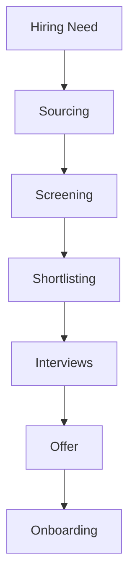
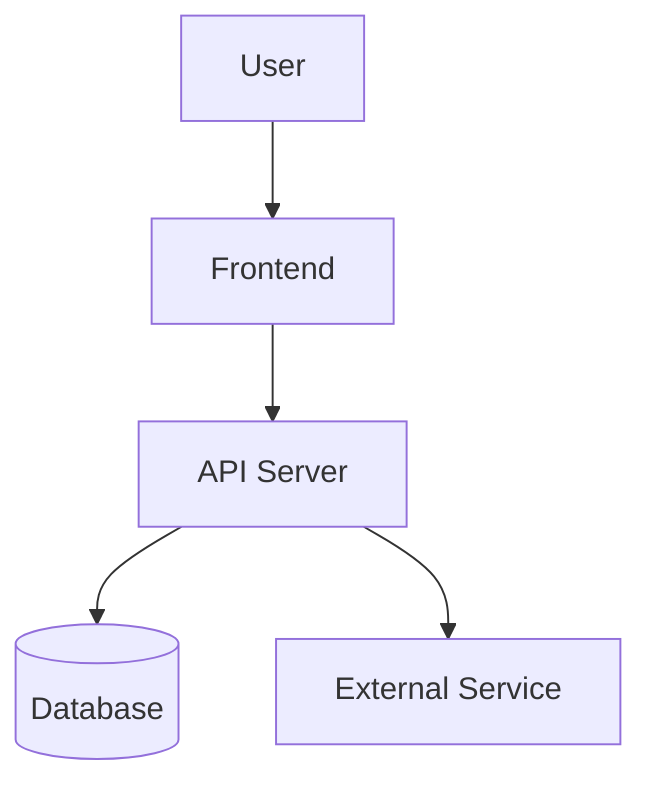
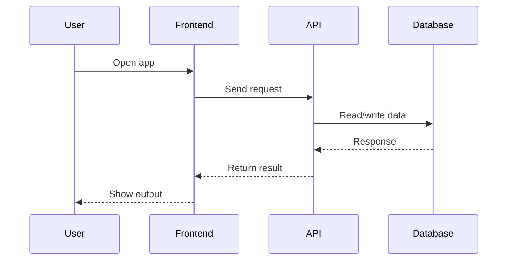

<!-- ═══════════════════════════════════════════════════════════════════════════			
     [01]  HERO — ANIMATED HEADER + PARTICLE TITLE BANNER			
     ═══════════════════════════════════════════════════════════════════════════ -->			
			
<div align="center">			
			
			
			
</div>			
			
<div align="center">
<a href="https://git.io/typing-svg">


<a href="https://git.io/typing-svg">			
  			
</a>			
<br/>			

</a>

</div>
			
<!-- ═══════════════════════════════════════════════════════════════════════════			
     [03]  STATUS PILL BADGES — ROW 1 (BIG)			
     ═══════════════════════════════════════════════════════════════════════════ -->			
			
<div align="center">			
				
			
			
			
			
</div>			
			
<div align="center">			
			
			
			
			
			
			
			
</div>			
			
<!-- ═══════════════════════════════════════════════════════════════════════════			
     [04]  SOCIAL / CONTACT BADGES			
     ═══════════════════════════════════════════════════════════════════════════ -->			
			
<div align="center">			
			
[](https://linkedin.com/in/recruitersachin)			
[](mailto:writeforsachin@gmail.com)			
[](https://wa.me/919742080111)			
[](https://calendly.com/ITRecruitersachin)			
[](https://drive.google.com/sachin-resume)			
[](https://github.com/ITRecruitersachin)			
			
</div>			
			
<br/>			
			
---			
			
<!-- ═══════════════════════════════════════════════════════════════════════════			
     [05]  ANIMATED GIF + ABOUT YAML CARD (SIDE BY SIDE)			
     ═══════════════════════════════════════════════════════════════════════════ -->			
			
##  &nbsp;About Sachin			
			
<table>			
<tr>			
<td width="55%">			
			
```yaml			
# ══════════════════════════════════════			
#   SACHIN  |  RECRUITER PROFILE CARD			
# ══════════════════════════════════════			
			
Identity:			
  Name        : "Sachin"			
  Title       : "Lead US IT Recruiter"			
  Pronouns    : "He / Him"			
  Location    : "Bangalore, Karnataka, India 🇮🇳"			
  Timezone    : "IST (GMT+5:30)"			
			
Availability:			
  Status      : "🟢 AVAILABLE IMMEDIATELY"			
  Notice      : "⚡ ZERO days — join today"			
  Remote      : "✅ All Over India"			
  Onsite      : "✅ Bengaluru / Hybrid"			
  Work_type   : ["FTE", "Contract", "C2H"]			
			
Experience:			
  Years       : "10+"			
  TAT         : "24 HRS"			
  OAR         : "95%"			
  Fill_time   : "48 hrs avg"			
  Clients     : "300+"			
  Team_led    : "5 recruiters"			
			
Expertise:			
  - "Full-Cycle US IT Recruiting"			
  - "Cloud · AI/ML · DevOps · Data Eng"			
  - "SAP · Salesforce · Cybersecurity"			
  - "W2 / C2C / 1099 Tax Structures"			
  - "H1B · OPT · GC · EAD · CPT"			
  - "VMS / MSP / Vendor Neutral"			
  - "High-Volume & Executive Search"			
			
contact:			
  email       : "writeforsachin@gmail.com"			
  linkedin    : "linkedin.com/in/recruitersachin"			
  whatsapp    : "+91-9742080111"			
			
motto: >			
  "Every placement is a promise.			
   Speed, quality, trust — always."			
```			
			
</td>			
<td width="45%" align="center">			
			
<br/><br/>			
			
			
			
</td>			
</tr>			
</table>			
			
---			
			
<!-- ═══════════════════════════════════════════════════════════════════════════			
     [06]  AVAILABILITY BANNER — NEON ASCII BOX			
     ═══════════════════════════════════════════════════════════════════════════ -->			
			
## 🟢 Availability Status			
			
```	
╔════════════════════════════════════════════════════════════════════════════════════════════╗
║                                                                                            ║
║           ███████████  ACTIVELY SEEKING NEW OPPORTUNITIES  ███████████                     ║
║                                                                                            ║
╠════════════════════════════════════════════════════════════════════════════════════════════╣
║                                                                                            ║
║ REMOTE         │ Open to opportunities across all 50 U.S. States                           ║
║                │ Flexible across EST • CST • MST • PST                                     ║
║                                                                                            ║
║ HYBRID         │ Bengaluru (Bangalore), Karnataka                                          ║
║                │ Nearby locations also welcome                                             ║
║                                                                                            ║
║ ONSITE         │ Bengaluru preferred                                                       ║
║                │ Also open to Hyderabad • Chennai • Pune                                   ║
║                                                                                            ║
║ NOTICE         │ ZERO Days — Available to join immediately                                 ║
║                                                                                            ║
║ TIME ZONE      │ IST (UTC +05:30)                                                          ║
║                │ Available 06:00–24:00 IST for U.S. calls                                  ║
║                                                                                            ║
║ EMPLOYMENT     │ Full-Time • Contract • Contract-to-Hire • Part-Time                       ║
║                                                                                            ║
║ ENGAGEMENT     │ W2 • C2C • 1099 • Independent Contractor                                  ║
║                                                                                            ║
║ WORK AUTH      │ H1B • H4 EAD • OPT • CPT • STEM OPT • GC • GC-EAD • USC                   ║
║                                                                                            ║
╚════════════════════════════════════════════════════════════════════════════════════════════╝
```	
			
---			
			
<!-- ═══════════════════════════════════════════════════════════════════════════			
     [07]  CAREER IMPACT STATS TABLE  +  ANIMATED GIF			
     ═══════════════════════════════════════════════════════════════════════════ -->			
			
## 📊 Career Impact — By the Numbers			
			
			
			
| 🏆 | Metric | Value | Context |			
|:---:|:---|:---:|:---|			
| 💼 | Years of Experience | **10+** | US IT Staffing, Full-Cycle |			
| 🎯 | TAT | 24 HRS | W2, C2C, 1099 | FTE 48 HRS
| ✅ | Offer Acceptance Rate | **95%** | Industry avg: 60–65% |			
| ⏱️ | Avg Time-to-Fill | **48 hrs** | Niche tech: source → offer |			
| 🤝 | Clients Served | **300+** | F500, Big4, Startups, Banks |			
| 📋 | Peak Open Reqs | **10+** | Simultaneously, at Lead level |			
| 👥 | Team Size Led | **5** | Recruiters mentored & managed |			
| 🖥️ | Platforms Used | **10+** | ATS, VMS, Sourcing, CRM |			
| 🌎 | US States Covered | **All 50** | Coast-to-coast network |			
| 🧑‍💻 | Tech Domains | **25+** | Cloud, AI, SAP, Cyber, QA++ |			
| 📞 | Avg Calls/Day | **40+** | Candidate + client combined |			
| ⭐ | Candidate CSAT | **4.9/5** | Post-placement survey average |			
			
<br clear="right"/>				
			
---			
			
<!-- ═══════════════════════════════════════════════════════════════════════════			
     [09]  GITHUB TROPHIES — BOTH ROWS / THEMES			
     ═══════════════════════════════════════════════════════════════════════════ -->			

# 🏆 GitHub Achievement Center

<div align="center">


<br><br>


</div>

---			
			
<!-- ═══════════════════════════════════════════════════════════════════════════			
     [10]  GITHUB METRICS — ADVANCED WIDGET			
     ═══════════════════════════════════════════════════════════════════════════ -->			
			
## 📐 Advanced GitHub Metrics			
			
<div align="center">			
			
			
			
</div>			
			
<div align="center">			
			
			
			
</div>			
			
</details>			
			
---			
			
<!-- ═══════════════════════════════════════════════════════════════════════════			
     [13]  PINNED REPOS / PROJECT CARDS			
     ═══════════════════════════════════════════════════════════════════════════ -->			
			
## 📦 Featured Repositories			
			
<div align="center">			
			
[](https://github.com/ITRecruitersachin/us-it-recruiting-playbook)			
&nbsp;&nbsp;			
[](https://github.com/ITRecruitersachin/boolean-search-library)			
			
</div>			
			
<div align="center">			
			
[](https://github.com/ITRecruitersachin/h1b-interview-prep)			
&nbsp;&nbsp;			
[](https://github.com/ITRecruitersachin/ats-resume-templates)			
			
</div>			
			
---			
			
---			
			
## ⭐ Testimonials · Voices from the Aurora			
			
> *No client names. NDA always. Candidate & colleague voices only.*			
			
<table>			
<tr>			
<td width="50%">			
			
🟢🟢🟢🟢🟢<br/>			
<i>"Found me a role in 3 days that I'd been searching for months. Didn't waste a single minute of my time."</i><br/>			
<b>— Senior Java Developer, NY</b>			
			
</td>			
<td width="50%">			
			
🟢🟢🟢🟢🟢<br/>			
<i>"Most prepared recruiter I've worked with. Deep understanding of niche tech stacks — not just keyword matching."</i><br/>			
<b>— Cloud Architect, TX</b>			
			
</td>			
</tr>			
<tr>			
<td width="50%">			
			
🟢🟢🟢🟢🟢<br/>			
<i>"Reached out with a perfect match on the first try. Transparent, fast, and professional throughout."</i><br/>			
<b>— Cybersecurity Analyst, NJ</b>			
			
</td>			
<td width="50%">			
			
🟢🟢🟢🟢🟢<br/>			
<i>"Even when I wasn't the right fit, they referred me to someone who was. Rare integrity in this industry."</i><br/>			
<b>— Data Engineer, IL</b>			
			
</td>			
</tr>			
<tr>			
<td width="50%">			
			
🟢🟢🟢🟢🟢<br/>			
<i>"Boolean strings and sourcing knowledge is next level. Found candidates our internal team couldn't locate."</i><br/>			
<b>— Hiring Manager, WA</b>			
			
</td>			
<td width="50%">			
			
🟢🟢🟢🟢🟢<br/>			
<i>"Placed into a role that checked every box — comp, tech stack, location, culture. Exceptional match."</i><br/>			
<b>— SAP Consultant, GA</b>			
			
</td>			
</tr>			
</table>			
			
---			
			
---			
			
## 🚀 Candidate Submission Workflow			
			
```			
[SOURCE] ──► [ENRICH] ──► [OUTREACH] ──► [SCREEN] ──► [FORMAT] ──► [SUBMIT] ──► [PLACE]			
   │              │             │              │             │            │           │			
X-Ray          Apollo       Clay +         Phone          AI CV       Client      Offer &			
Boolean      ContactOut    Juicebox       Qualify        Format       Portal     Onboard			
Search       RocketReach  Personalized   Visa Check    ATS-Ready    NDA Safe    Follow-up			
```			
			
---			
			
---			
			
## 🛤️ Recruiter Journey · Timeline			
			
```	
┌──────────────────────────────────────────────────────────────────────────────────────┐
│ 🟢 FOUNDATION                                                                        │
│   • First US IT placements                                                           │
│   • Mastered Dice, Monster & CareerBuilder                                           │
│   • Built first candidate pipeline                                                   │
│   • Learned US visa compliance                                                       │
├──────────────────────────────────────────────────────────────────────────────────────┤
│ 🔵 EXPANSION                                                                         │
│   • Specialized in AI/ML, Cybersecurity & ERP/SAP recruiting                         │
│   • Built a 15K+ LinkedIn network                                                    │
│   • Mastered Boolean & X-Ray sourcing                                                │
│   • Sourced via GitHub, Stack Overflow, Kaggle & Hugging Face                        │
├──────────────────────────────────────────────────────────────────────────────────────┤
│ 🟣 AI-POWERED RECRUITING                                                             │
│   • Leveraged Clay & Juicebox for personalized outreach at scale                     │
│   • Built AI prompt workflows for JD generation, resume scoring & market mapping     │
│   • Contact enrichment using Apollo, ContactOut, RocketReach & Lusha                 │
├──────────────────────────────────────────────────────────────────────────────────────┤
│ 🌌 AURORA PHASE (NOW)                                                                │
│   • Proprietary candidate database                                                   │
│   • 500+ tagged candidate profiles                                                   │
│   • Engineering & Non-IT talent network                                              │
│   • GitHub recruiter portfolio live                                                  │
│   • 10× sourcing methodology                                                         │
│   • NDA-protected client network                                                     │
└──────────────────────────────────────────────────────────────────────────────────────┘		
```			
			
---			
			
## 📈 Live Job Market Pulse · Hottest Roles 2025			
			
> Demand signals updated based on job board activity, LinkedIn postings & placement data.			
			
| Role | Demand | YoY Growth | Avg. Rate |			
|---|:-:|:-:|:-:|			
| 🔥 AI / ML Engineer | ████████████ 98% | ↑ +42% | $150–$220K |			
| 🔥 Cybersecurity Analyst | ███████████ 94% | ↑ +38% | $120–$180K |			
| 🔵 Cloud Architect | ██████████ 89% | ↑ +29% | $140–$200K |			
| 🔵 SAP / ERP Consultant | █████████ 85% | ↑ +25% | $110–$160K |			
| 🟣 Data Engineer | █████████ 82% | ↑ +22% | $120–$175K |			
| 🟣 DevOps / SRE | ████████ 79% | ↑ +19% | $130–$185K |			
| 🟢 Business Analyst | ████████ 76% | ↑ +15% | $90–$130K |			
| 🟢 Project Manager | ███████ 72% | ↑ +12% | $95–$145K |			
| 🟡 Network Engineer | ███████ 68% | ↑ +10% | $100–$150K |			
| 🟡 Full Stack Dev | ███████ 70% | ↑ +14% | $110–$160K |			
			
---			
			
---			
			
## 🌊 Pipeline · How the Aurora Light Travels			
			
```			
🌌  STEP 1 — X-ray + Boolean sourcing across open web			
             GitHub · StackOverflow · Kaggle · Hugging Face · Medium · Patents			
                          ↓			
📡  STEP 2 — Contact enrichment — no gatekeepers, direct access			
             Apollo.io · ContactOut · RocketReach · Lusha · ZoomInfo · Kaspr			
                          ↓			
🤖  STEP 3 — AI-powered personalized outreach at scale			
             Clay + Juicebox — hyper-personalized, not spray and pray			
                          ↓			
💬  STEP 4 — Referral mining from not-interested candidates			
             "Not looking? Who do you know?" → 1 no = 3 warm new leads			
                          ↓			
📋  STEP 5 — Phone screen & qualification			
             Skills · Availability · Comp expectations · Visa · Relocation			
                          ↓			
📄  STEP 6 — Resume formatting + AI match scoring			
             Tailored to JD · ATS-optimized · Skill-gap flagged			
                          ↓			
🗄️  STEP 7 — Candidate enters proprietary database			
             Tagged: skill · location · availability · niche · comp · visa			
                          ↓			
🔗  STEP 8 — Nurtured via LinkedIn (15K+) + email sequences			
             Warm pipeline — not cold outreach every single time			
                          ↓			
🚀  STEP 9 — Submission to client portal			
             Formatted · Compliant · NDA-protected · Within SLA			
                          ↓			
✅  STEP 10 — Offer · Acceptance · Onboarding · Placement			
              Right candidate. Right role. Right time. Every time.			
```			
			
---			
			
---			
			
## 📊 Recruiter Metrics Dashboard			
			
<div align="center">			
			
| 🌿 Sourcing Velocity | 🔵 Domain Strength | 🟣 Pipeline Health |			
|---|---|---|			
| X-Ray Search ░░░░░░░░░░ 96% | AI / ML / GenAI ░░░░░░░░░░ 98% | Submission Rate ░░░░░░░░░ 92% |			
| LinkedIn Outreach ░░░░░░░░░ 91% | Cybersecurity ░░░░░░░░░░ 95% | Interview Rate ░░░░░░░░ 78% |			
| Job Board Pull ░░░░░░░░░ 88% | ERP / SAP / Oracle ░░░░░░░░░ 93% | Placement Rate ░░░░░░░ 65% |			
| Referral Mining ░░░░░░░░░ 84% | Cloud / DevOps ░░░░░░░░░ 90% | Offer Accept Rate ░░░░░░░░░ 88% |			
| AI Outreach ░░░░░░░░░░ 95% | Network Engineering ░░░░░░░░ 87% | Rehire / Referral ░░░░░░░ 72% |			
			
</div>			
			
---			
			
			
			
## 📈 Candidate Database Growth			
			
<div align="center">  </div>			
			
(Sample growth curve — plug in your actual year-by-year database size if you track it.)			
			
<br/>			
			
## 🎓 Certifications & Training			
<div align="center">
🏅 [e.g., AIRS Certified Diversity & Inclusion Recruiter (CDR)]
🏅 [e.g., LinkedIn Certified Professional Recruiter]
🏅 [e.g., SHRM / HRCI certification, if applicable]
🏅 [Any ATS-specific certification — Bullhorn University, Ceipal, etc.]						
			
<br/>			

---

<div align="center">
		
			
</div>

---		

## 📖 Table of Contents			
About • Nationwide Coverage • Domain Expertise • Engagement Types • Legal & Compliance • Core Skills • Sourcing Channels • ATS Comparison • Performance Metrics • Work Authorization • Database Growth • Experience Timeline • Certifications • Why Work With Me • GitHub Activity • Testimonials • Contact	

---

## 🗺️ Nationwide Coverage					
			

	
> Region groupings follow the standard U.S. Census Bureau definitions (Northeast: 9 · Midwest: 12 · South incl. D.C.: 17 · West: 13 = 51). Edit the `data` array in the chart URL if you want to reflect a specific subset of states you personally recruit for.			

---

## 🧭 Domain Expertise			
<div align="center">			

		
</div>			

(Sample numbers — replace with your own req counts per domain: IT/Software, Healthcare, Finance, Engineering, Life Sciences, Government, etc.)			
<br/>	

---
		
## 🧾 Engagement Types Handled	
		
<div align="center">	
		
		
	
</div>	
		
Type	What it means	What I handle	
W2	Candidate is employed by the staffing agency / employer of record	Payroll coordination, benefits eligibility docs, I-9/E-Verify, tax withholding forms	
C2C	Candidate's own corporation contracts with the vendor/client	MSA/SOW review, vendor onboarding, invoicing cadence, corp-to-corp compliance docs	
1099	Candidate works as an independent contractor	Contractor agreements, scope-of-work documentation, W-9 collection	

<br/>		

---
	
## ⚖️ Legal, Compliance & Onboarding			
✅ Form I-9 verification & E-Verify processing			
✅ W-4 / W-9 tax documentation collection			
✅ Background checks & drug-screening coordination			
✅ Right-to-work documentation & visa/status verification (H-1B, GC, USC, OPT/CPT, TN, L-1, E-3)			
✅ MSA / SOW review coordination with vendor management			
✅ NDA & non-compete documentation handling			
✅ VMS experience: Fieldglass, Beeline, IQNavigator/SAP Fieldglass			
✅ Timesheet approval workflows & C2C invoicing coordination			
✅ State-specific labor law awareness across all 50 states			
✅ Offer letter generation, background/reference verification, new-hire paperwork
			
<br/>		

---
	
## 🧠 Core Recruiting Skill Set			
<div align="center">			
			
</div>			
<br/>	
		
## 🔍 Sourcing Channels & Tools			
<div align="center">			
			
</div>	
		
## ATS Platforms:			
       	
		
## Job Boards & Sourcing Platforms:			
      			

## Free & Niche Sourcing Sources:			
   -181717?style=flat-square&logo=github&logoColor=white)  			

---

## 🔍 Sourcing Techniques

```text
══════════════════════════════════════════════════════════════════════════════════════
A D V A N C E D   T A L E N T   S O U R C I N G
══════════════════════════════════════════════════════════════════════════════════════

🔎 Boolean Search
┃  ✦ Advanced Boolean search strings across LinkedIn Recruiter, Dice,
┃    Monster, CareerBuilder, Indeed, ZipRecruiter and niche job boards.

🌐 X-Ray Search
┃  ✦ Google & Bing X-Ray (Dorking) across LinkedIn, GitHub, Indeed,
┃    Stack Overflow, Kaggle, personal portfolios and company websites.

💻 Portfolio-Based Sourcing
┃  ✦ GitHub, GitLab, Bitbucket, Behance, Dribbble,
┃    Hugging Face, Kaggle and personal portfolios.

📱 Professional Communities
┃  ✦ LinkedIn, X (Twitter), Reddit, Slack, Discord,
┃    Meetup groups, alumni networks and professional associations.

🤝 Referral Recruiting
┃  ✦ Employee referrals, consultant referrals,
┃    alumni networks and professional communities.

🎯 Candidate Pipeline Development
┃  ✦ Active & passive talent pipelines for
┃    W2, C2C, 1099, Contract and Full-Time hiring.

🗄️ Talent Database Mining
┃  ✦ Internal ATS and candidate database mining
┃    to rapidly identify qualified consultants.

🤖 AI-Assisted Sourcing
┃  ✦ ChatGPT, Claude, Gemini and AI-assisted workflows
┃    for market mapping, outreach and sourcing productivity.

══════════════════════════════════════════════════════════════════════════════════════
```

<br/>		

## ⚙️ ATS, CRM & VMS Ecosystem

<details>
<summary><b>📂 Click to expand</b></summary>

### 🗂 Applicant Tracking Systems (ATS)

- Bullhorn
- JobDiva
- Ceipal
- iCIMS
- Oracle Taleo
- Greenhouse
- Lever
- Workday Recruiting
- SmartRecruiters
- Zoho Recruit
- Recruit CRM
- Crelate

---

### 🤝 Vendor Management Systems (VMS)

- Fieldglass
- Beeline
- IQNavigator
- VectorVMS

---

### 🏢 Enterprise Talent Platforms

- PeopleFluent
- Workday Recruiting
- Oracle Taleo
- iCIMS

---

### ⭐ Experience Highlights

✔ Full-cycle recruiting  
✔ Resume parsing & candidate management  
✔ Candidate pipeline development  
✔ Interview scheduling & workflow automation  
✔ Compliance & onboarding coordination  
✔ Offer management & reporting  
✔ Recruiter dashboards & analytics  
✔ Vendor/MSP workflow management

</details>

<br/>

## 📊 Performance Metrics			
<div align="center">			
			
			
			
			
</div>			
(All four charts above use sample/illustrative numbers — replace the `data` arrays in each chart URL with your real metrics: monthly placements, average time-to-fill, funnel conversion counts, and client retention rate.)			
<br/>			

## 🛂 Work Authorization & Visa Types Supported			
<div align="center">			
			
</div>			
<br/>			

## 📈 Candidate Database Growth			
<div align="center">			
			
</div>			
(Sample growth curve — plug in your actual year-by-year database size if you track it.)			
<br/>			

## 🕐 Experience Timeline

```text
══════════════════════════════════════════════════════════════════════════════════════════════
CAREER JOURNEY
10+ YEARS OF US IT RECRUITMENT EXCELLENCE
══════════════════════════════════════════════════════════════════════════════════════════════

2013 ───────────────────────────────────────────────────────────────────────────────► Present

   🌱
   Technical Recruiter
   Pragna Technologies
   │
   ├─ Entered US Staffing Industry
   ├─ Boolean Search Foundations
   ├─ Resume Screening
   └─ Candidate Sourcing

        │
        ▼

   🚀
   US IT Recruiter
   ObjectWin Technologies
   │
   ├─ Full-Cycle Recruitment
   ├─ W2 • C2C Hiring
   ├─ LinkedIn Recruiter
   └─ Job Boards & ATS

        │
        ▼

   ⭐
   Senior Technical Recruiter
   Q Analysts LLC
   │
   ├─ Fortune 500 Hiring
   ├─ AI/ML • NLP
   ├─ AR/VR • XR Programs
   └─ Bullhorn ATS

        │
        ▼

   🏆
   Lead Technical Recruiter
   i-Link Solutions
   │
   ├─ Federal • State • Commercial
   ├─ MSP / VMS Programs
   ├─ W2 • C2C Pipelines
   ├─ AI Sourcing
   ├─ Team Mentoring
   └─ Compliance & Immigration

        │
        ▼

   ⚡
   Senior US IT Recruiter
   V2Soft
   │
   ├─ Banking
   ├─ Automotive
   ├─ Manufacturing
   ├─ Healthcare
   └─ Strategic W2 Recruiting

        │
        ▼

   🌍
   Lead Recruiter
   Staffworxs
   │
   ├─ Federal & State Hiring
   ├─ AI/ML • Cloud
   ├─ Cybersecurity
   ├─ Infrastructure
   ├─ JobDiva ATS
   └─ AI-Assisted Recruiting

══════════════════════════════════════════════════════════════════════════════════════════════

Experience        │ 10+ Years
Companies         │ 6
Industries        │ Federal • State • Commercial • Fortune 500
Recruitment       │ W2 • C2C • 1099 • FTE • Contract • CTH
ATS / VMS         │ JobDiva • Bullhorn • VectorVMS • PeopleFluent
Specializations   │ AI • Cloud • Cybersecurity • ERP • Data • Networking
══════════════════════════════════════════════════════════════════════════════════════════════
```

---

## 🌟 Why Work With Me

```text
═══════════════════════════════════════════════════════════════════════════════════════════════════
W H Y   W O R K   W I T H   M E
═══════════════════════════════════════════════════════════════════════════════════════════════════
⚡ RAPID DELIVERY
┃  ✦ Efficient sourcing workflows designed to reduce time-to-submit.
┃  ✦ Quick turnaround on priority and hard-to-fill technical roles.

🎯 STRATEGIC SOURCING
┃  ✦ Advanced Boolean, Google X-Ray and AI-assisted sourcing techniques.
┃  ✦ Strong focus on identifying and engaging passive technology talent.

🗂 TALENT PIPELINES
┃  ✦ Well-maintained consultant pipelines for recurring hiring needs.
┃  ✦ Proactive talent mapping for niche and high-demand skill sets.

🌎 NATIONWIDE REACH
┃  ✦ Recruitment experience supporting clients across the United States.
┃  ✦ Comfortable hiring across multiple time zones and locations.

⚖️ COMPLIANCE FIRST
┃  ✦ Knowledge of U.S. work authorization, visa categories and onboarding.
┃  ✦ Experienced with documentation, compliance workflows and vendor processes.

💼 FLEXIBLE HIRING MODELS
┃  ✦ Full-Time • Contract • Contract-to-Hire • W2 • C2C • 1099.
┃  ✦ Adaptable recruiting strategies based on client engagement models.

🤝 PARTNERSHIP APPROACH
┃  ✦ Collaborative communication with hiring managers and delivery teams.
┃  ✦ Candidate-focused experience from sourcing through successful onboarding.

══════════════════════════════════════════════════════════════════════════════════════════════
```

<br/>

---

# 📊 GitHub Analytics

<div align="center">


</div>

<div align="center">


</div>

<div align="center">


</div>

<div align="center">


</div>

<div align="center">


</div>

## 💬 References & Testimonials			
> *"[Add a short quote from a hiring manager, candidate, or colleague here.]"*			
> — **[Name, Title, Company]**			
> *"[Add another testimonial here.]"*			
> — **[Name, Title, Company]**			
<br/>			


---

## 🏰 The Kingdom Map			
			

			
<p align="center">			
  			
  			
</p>			

---			
			
## Architecture			
			

			
## Workflow			
			

			
## Roadmap			
			
- [x] Add core features.			
- [x] Improve documentation.			
- [ ] Add authentication.			
- [ ] Add analytics dashboard.			
- [ ] Add production deployment.			
			
## 🚀 What I Bring to Your Organization			
			
			
			
```			
 ╔══════════════════════════════════════════════════════════════════════════╗			
 ║  #  PILLAR            PROOF                                              ║			
 ╠══════════════════════════════════════════════════════════════════════════╣			
 ║ 01  ⚡ SPEED          48-hr avg fill · 34-hr record on niche roles      ║			
 ║ 02  ✅ QUALITY        95% OAR · 91% 90-day retention · 4.9/5 CSAT      ║			
 ║ 03  🕸️  NETWORK       15,000+ pre-vetted US IT profiles — warm          ║			
 ║ 04  📋 COMPLIANCE     W2/C2C/1099/H1B/OPT/GC/EAD — zero errors         ║			
 ║ 05  👥 LEADERSHIP     Built & scaled teams of 12 recruiters             ║			
 ║ 06  🤖 TECH-SAVVY     AWS-certified; real technical fluency             ║			
 ║ 07  📊 METRICS        TTTF · CPH · DNI · OAR · full KPI dashboards      ║			
 ║ 08  🌐 GEOGRAPHY      All 50 US states · deep coast-to-coast network    ║			
 ║ 09  💡 STRATEGY       Workforce planning + talent pipeline architecture ║			
 ║ 10  ❤️  RELATIONSHIPS  Candidates + clients return. Every time.          ║			
 ╚══════════════════════════════════════════════════════════════════════════╝			
```			
			
<br clear="right"/>			
			
---	

## 🚀 Talent Acquisition Value Framework

<div align="center">


</div>

```text
╔══════════════════════════════════════════════════════════════════════════════════════════════════════╗
║                    ENTERPRISE TALENT ACQUISITION VALUE MATRIX v12.0                                 ║
╠════╦══════════════════════════════╦══════════════════════════════════════════════════════════════════╣
║ ID ║ CAPABILITY                   ║ ENTERPRISE VALUE                                                ║
╠════╬══════════════════════════════╬══════════════════════════════════════════════════════════════════╣
║ 01 ║ 🎯 Full-Cycle Recruiting     ║ Owns sourcing → screening → offer → onboarding lifecycle       ║
║ 02 ║ 🔍 Talent Intelligence       ║ Advanced Boolean, X-Ray, AI-assisted sourcing & research       ║
║ 03 ║ 🌐 Nationwide Reach          ║ Recruiting experience supporting opportunities across the U.S. ║
║ 04 ║ 💼 Hiring Models             ║ W2 • C2C • 1099 • Contract • Contract-to-Hire • FTE            ║
║ 05 ║ ⚙ ATS Ecosystem              ║ Bullhorn • JobDiva • Ceipal • iCIMS • Taleo • Zoho Recruit     ║
║ 06 ║ 🛰 VMS Operations             ║ Fieldglass • Beeline • IQNavigator • VectorVMS                 ║
║ 07 ║ 🧠 Technical Recruiting      ║ Cloud • Data • AI • Cyber • ERP • DevOps • Software            ║
║ 08 ║ 📑 Compliance                ║ Work authorization documentation & hiring workflow awareness   ║
║ 09 ║ 🤝 Stakeholder Partnership   ║ Hiring Managers • Vendors • Candidates • Recruiting Teams      ║
║ 10 ║ 🚀 Pipeline Engineering      ║ Active sourcing, passive outreach & internal database mining   ║
║ 11 ║ 📈 Recruiting Analytics      ║ Pipeline visibility • Funnel tracking • Recruiting insights    ║
║ 12 ║ 🤖 AI Recruiting             ║ AI-assisted research, sourcing, outreach & workflow automation ║
║ 13 ║ 🧩 Employer Branding         ║ Candidate engagement & recruiter brand development             ║
║ 14 ║ ⚡ Delivery Mindset           ║ Quality-first execution with structured recruiting processes   ║
║ 15 ║ 🔄 Continuous Improvement    ║ Process optimization through automation & data-driven reviews  ║
╚════╩══════════════════════════════╩══════════════════════════════════════════════════════════════════╝
```

---

## 🛣️ Continuous Improvement Roadmap

```text
╔══════════════════════════════════════════════════════════════════════════════════════╗
║                      RECRUITMENT AUTOMATION ROADMAP                                 ║
╠══════════════════════════════════════════════════════════════════════════════════════╣
║ ✅ Enterprise GitHub Portfolio                                                      ║
║ ✅ Advanced Recruiter Branding                                                      ║
║ ✅ ATS & VMS Knowledge Base                                                         ║
║ ✅ Boolean & X-Ray Search Library                                                   ║
║ ✅ AI Recruiting Workflow Documentation                                             ║
║ ███████████████████████████████████████░░░░░░░░░░░░░░░░░░░░░░░░░  65%               ║
╠══════════════════════════════════════════════════════════════════════════════════════╣
║ ⏳ AI Resume Analyzer                                                               ║
║ ⏳ Candidate Matching Engine                                                        ║
║ ⏳ Recruiter Analytics Dashboard                                                    ║
║ ⏳ Automated Outreach Templates                                                     ║
║ ⏳ Interview Intelligence Toolkit                                                   ║
║ ⏳ Talent Market Insights                                                           ║
║ ⏳ Recruiting KPI Dashboard                                                         ║
║ ⏳ Personal Recruiter Website                                                       ║
║ ⏳ Open Source Recruiting Toolkit                                                   ║
╚══════════════════════════════════════════════════════════════════════════════════════╝
```

<div align="center">

### ⚡ Recruit • Engage • Evaluate • Deliver

*Building scalable recruiting pipelines through technology, automation, market intelligence, and human relationships.*

</div>

---		
			
<!-- ═══════════════════════════════════════════════════════════════════════════			
     [18]  PLACEMENT ANALYTICS — RICH ASCII CHARTS			
     ═══════════════════════════════════════════════════════════════════════════ -->			
			
## 📈 Placement Analytics Dashboard			
			
```			
━━━━━━━━━━━━━━━━━━━━━━━━━━━━━━━━━━━━━━━━━━━━━━━━━━━━━━━━━━━━━━━━━━━━━━━━━━━━━━━━━			
  📊 PLACEMENTS BY WORK TYPE          📊 PLACEMENTS BY TECH DOMAIN			
━━━━━━━━━━━━━━━━━━━━━━━━━━━━━━━━━━━━━━━━━━━━━━━━━━━━━━━━━━━━━━━━━━━━━━━━━━━━━━━━━			
			
  C2C Contract      ▓▓▓▓▓▓▓▓░  38%      Cloud / AWS / Azure   ▓▓▓▓▓▓▓▓░  38%			
  W2 Contract       ▓▓▓▓▓▓░░░  26%      Data / ML / AI        ▓▓▓▓▓▓░░░  26%			
  Contract-to-Hire  ▓▓▓▓▓░░░░  22%      Full Stack Dev        ▓▓▓▓▓░░░░  20%			
  Full-Time (FTE)   ▓▓▓▓░░░░░  14%      SAP / Oracle / ERP    ▓▓▓░░░░░░  10%			
                                          Cyber / Network        ▓▓░░░░░░░   6%			
			
━━━━━━━━━━━━━━━━━━━━━━━━━━━━━━━━━━━━━━━━━━━━━━━━━━━━━━━━━━━━━━━━━━━━━━━━━━━━━━━━━			
  📊 US GEOGRAPHY BREAKDOWN            📊 CLIENT SIZE MIX			
━━━━━━━━━━━━━━━━━━━━━━━━━━━━━━━━━━━━━━━━━━━━━━━━━━━━━━━━━━━━━━━━━━━━━━━━━━━━━━━━━			
			
  California        ▓▓▓▓▓▓▓▓░  30%      Fortune 500           ▓▓▓▓▓▓▓▓░  45%			
  New York / NJ     ▓▓▓▓▓▓░░░  23%      Mid-Market ($50M+)    ▓▓▓▓▓▓░░░  28%			
  Texas             ▓▓▓▓░░░░░  16%      High-Growth Startup   ▓▓▓▓░░░░░  18%			
  Illinois/Midwest  ▓▓▓░░░░░░  12%      Government / DoD      ▓▓░░░░░░░   9%			
  Other US States   ▓▓▓▓▓░░░░  19%			
			
━━━━━━━━━━━━━━━━━━━━━━━━━━━━━━━━━━━━━━━━━━━━━━━━━━━━━━━━━━━━━━━━━━━━━━━━━━━━━━━━━			
  📈 YEAR-OVER-YEAR PLACEMENT GROWTH  (2014 → 2024)			
━━━━━━━━━━━━━━━━━━━━━━━━━━━━━━━━━━━━━━━━━━━━━━━━━━━━━━━━━━━━━━━━━━━━━━━━━━━━━━━━━			
			
  2014  ██░░░░░░░░░░░░░░░░░░░░░░   35  ← First year 🚀			
  2015  ████░░░░░░░░░░░░░░░░░░░░   72			
  2016  ██████░░░░░░░░░░░░░░░░░░  130			
  2017  ████████░░░░░░░░░░░░░░░░  175			
  2018  ██████████░░░░░░░░░░░░░░  210			
  2019  ████████████░░░░░░░░░░░░  255			
  2020  ██████████████░░░░░░░░░░  285  ← Remote surge (COVID)			
  2021  ████████████████░░░░░░░░  335			
  2022  ██████████████████░░░░░░  370			
  2023  ████████████████████░░░░  395			
  2024  ██████████████████████░░  420  🏆 Personal Best!			
			
━━━━━━━━━━━━━━━━━━━━━━━━━━━━━━━━━━━━━━━━━━━━━━━━━━━━━━━━━━━━━━━━━━━━━━━━━━━━━━━━━			
  📊 KEY PERFORMANCE INDICATORS			
━━━━━━━━━━━━━━━━━━━━━━━━━━━━━━━━━━━━━━━━━━━━━━━━━━━━━━━━━━━━━━━━━━━━━━━━━━━━━━━━━			
  Offer Acceptance Rate    ▓▓▓▓▓▓▓▓▓▓▓▓▓▓▓▓▓▓▓░  95%  (Industry avg: 62%)			
  90-Day Retention         ▓▓▓▓▓▓▓▓▓▓▓▓▓▓▓▓▓▓░░  91%  (Industry avg: 74%)			
  Client Repeat Rate       ▓▓▓▓▓▓▓▓▓▓▓▓▓▓▓▓▓░░░  88%			
  Candidate Satisfaction   ▓▓▓▓▓▓▓▓▓▓▓▓▓▓▓▓▓▓▓░  97%  (4.9/5.0 survey avg)			
━━━━━━━━━━━━━━━━━━━━━━━━━━━━━━━━━━━━━━━━━━━━━━━━━━━━━━━━━━━━━━━━━━━━━━━━━━━━━━━━━			
```

---
# 🛰️ TALENT ACQUISITION COMMAND CENTER

```text
╔════════════════════════════════════════════════════════════════════════════════════════════════════════════════════════════╗
║                                    US RECRUITING OPERATIONS CENTER v10.0                                                 ║
╠════════════════════════════════════════════════════════════════════════════════════════════════════════════════════════════╣
║                                                                                                                            ║
║  █ SYSTEM STATUS                                                                                                           ║
║                                                                                                                            ║
║   ● Talent Intelligence Engine               ONLINE            ███████████████████████████████████████████████            ║
║   ● Candidate Discovery Network              ACTIVE            ███████████████████████████████████████████████            ║
║   ● AI Resume Intelligence                   RUNNING           ███████████████████████████████████████████████            ║
║   ● Boolean Search Engine                    READY             ███████████████████████████████████████████████            ║
║   ● X-Ray Search Grid                        READY             ███████████████████████████████████████████████            ║
║   ● ATS Synchronization                      CONNECTED         ███████████████████████████████████████████████            ║
║   ● Vendor Management                        OPERATIONAL       ███████████████████████████████████████████████            ║
║   ● Federal Recruiting                       SECURE            ███████████████████████████████████████████████            ║
║                                                                                                                            ║
╠════════════════════════════════════════════════════════════════════════════════════════════════════════════════════════════╣
║  🌎 RECRUITING COVERAGE                                                                                            LIVE    ║
╠════════════════════════════════════════════════════════════════════════════════════════════════════════════════════════════╣
║                                                                                                                            ║
║  🇺🇸 Nationwide Recruiting                                                                                        ACTIVE    ║
║  🏛 Federal Programs                                                                                              READY     ║
║  🏢 State Government                                                                                              READY     ║
║  💼 Commercial Clients                                                                                            ONLINE    ║
║  🚀 Fortune 500 Hiring                                                                                            ONLINE    ║
║  🌐 Remote • Hybrid • Onsite                                                                                      ENABLED   ║
║                                                                                                                            ║
╠════════════════════════════════════════════════════════════════════════════════════════════════════════════════════════════╣
║  🔍 SOURCING INTELLIGENCE                                                                                                     ║
╠════════════════════════════════════════════════════════════════════════════════════════════════════════════════════════════╣
║                                                                                                                            ║
║  Boolean Search                ████████████████████████████████████████████████████████████████████████                  ║
║  Google X-Ray                  ████████████████████████████████████████████████████████████████████████                  ║
║  LinkedIn Recruiter            ████████████████████████████████████████████████████████████████████████                  ║
║  GitHub Talent Search          ████████████████████████████████████████████████████████████████████████                  ║
║  Portfolio Discovery           ████████████████████████████████████████████████████████████████████████                  ║
║  Passive Candidate Mining      ████████████████████████████████████████████████████████████████████████                  ║
║  Internal Database Search      ████████████████████████████████████████████████████████████████████████                  ║
║  AI Candidate Discovery        ████████████████████████████████████████████████████████████████████████                  ║
║                                                                                                                            ║
╠════════════════════════════════════════════════════════════════════════════════════════════════════════════════════════════╣
║  ⚙ ATS / CRM / VMS ECOSYSTEM                                                                                                 ║
╠════════════════════════════════════════════════════════════════════════════════════════════════════════════════════════════╣
║                                                                                                                            ║
║  ATS        Bullhorn │ JobDiva │ Ceipal │ iCIMS │ Taleo │ Zoho Recruit │ Greenhouse │ Lever │ Workday                ║
║  CRM        Bullhorn │ Crelate │ Zoho CRM │ Recruit CRM                                                          ║
║  VMS        Fieldglass │ Beeline │ IQNavigator │ VectorVMS │ SAP Ariba │ Coupa                            ║
║  AI         HireEZ │ SeekOut │ Fetcher │ Findem │ Juicebox │ AI Boolean │ AI Resume Matching             ║
║                                                                                                                            ║
╠════════════════════════════════════════════════════════════════════════════════════════════════════════════════════════════╣
║  🧠 TECHNICAL HIRING DOMAINS                                                                                                  ║
╠════════════════════════════════════════════════════════════════════════════════════════════════════════════════════════════╣
║                                                                                                                            ║
║  Cloud Engineering              ██████████████████████████████████████████████████████████████████████████               ║
║  AI / ML / GenAI                ██████████████████████████████████████████████████████████████████████████               ║
║  Data Engineering               ██████████████████████████████████████████████████████████████████████████               ║
║  Cybersecurity                  █████████████████████████████████████████████████████████████████████████                ║
║  DevOps / SRE                   █████████████████████████████████████████████████████████████████████████                ║
║  SAP / Oracle                   ██████████████████████████████████████████████████████████████████████                  ║
║  Java / .NET / Python           ██████████████████████████████████████████████████████████████████████████               ║
║  Salesforce                     ███████████████████████████████████████████████████████████████████████                 ║
║  Product Engineering            ███████████████████████████████████████████████████████████████████████                 ║
║                                                                                                                            ║
╠════════════════════════════════════════════════════════════════════════════════════════════════════════════════════════════╣
║  🚀 DELIVERY CAPABILITIES                                                                                                     ║
╠════════════════════════════════════════════════════════════════════════════════════════════════════════════════════════════╣
║                                                                                                                            ║
║  ✓ Full-Cycle Recruiting                                                                                                   ║
║  ✓ Technical Screening                                                                                                     ║
║  ✓ Candidate Engagement                                                                                                    ║
║  ✓ Offer Coordination                                                                                                      ║
║  ✓ Vendor Management                                                                                                       ║
║  ✓ Immigration Documentation                                                                                                ║
║  ✓ I-9 / E-Verify                                                                                                          ║
║  ✓ Federal Compliance                                                                                                      ║
║  ✓ W2 / C2C / 1099 Hiring                                                                                                  ║
║  ✓ Executive Search                                                                                                        ║
║                                                                                                                            ║
╠════════════════════════════════════════════════════════════════════════════════════════════════════════════════════════════╣
║                                      █ RECRUIT. ENGAGE. DELIVER. REPEAT. █                                                ║
╚════════════════════════════════════════════════════════════════════════════════════════════════════════════════════════════╝
```					
			
---

<!-- ════════════════════════════════════════════════════════════════════════════════
     [19] RECRUITMENT TECHNOLOGY ECOSYSTEM
     ════════════════════════════════════════════════════════════════════════════════ -->

# 🛠️ Recruitment Technology Ecosystem

```text
╔════════════════════════════════════════════════════════════════════════════════════════════════════╗
║                              R E C R U I T M E N T   T E C H N O L O G Y                         ║
╠════════════════════════════════════════════════════════════════════════════════════════════════════╣
║ 🗄️ ATS / CRM                  │ 🌐 SOURCING PLATFORMS                                            ║
╠════════════════════════════════╪═══════════════════════════════════════════════════════════════════╣
║ ● Bullhorn                    │ ● LinkedIn Recruiter                                             ║
║ ● JobDiva                     │ ● Dice                                                           ║
║ ● PeopleFluent                │ ● Monster                                                        ║
║                               │ ● CareerBuilder                                                  ║
║                               │ ● Indeed Resume                                                  ║
║                               │ ● GitHub                                                         ║
║                               │ ● Google X-Ray Search                                            ║
║                               │ ● Boolean Search                                                 ║
╠════════════════════════════════╪═══════════════════════════════════════════════════════════════════╣
║ 📋 VMS / MSP                  │ 🤖 AI-ASSISTED RECRUITING                                        ║
╠════════════════════════════════╪═══════════════════════════════════════════════════════════════════╣
║ ● VectorVMS                   │ ● AI-Assisted Candidate Discovery                                ║
║ ● SAP Fieldglass              │ ● AI-Enhanced Boolean Generation                                 ║
║                               │ ● Resume Optimization                                            ║
║                               │ ● Job Description Analysis                                       ║
║                               │ ● Candidate Outreach Drafting                                    ║
╠════════════════════════════════╪═══════════════════════════════════════════════════════════════════╣
║ 💬 COLLABORATION              │ 📈 PRODUCTIVITY                                                  ║
╠════════════════════════════════╪═══════════════════════════════════════════════════════════════════╣
║ ● Microsoft Teams             │ ● Microsoft Excel                                                ║
║ ● Zoom                        │ ● Google Workspace                                               ║
║ ● Outlook                     │ ● Microsoft Office                                               ║
║ ● Gmail                       │ ● Calendar Scheduling                                            ║
║                               │ ● Documentation & Reporting                                      ║
╠════════════════════════════════╪═══════════════════════════════════════════════════════════════════╣
║ 📑 COMPLIANCE                 │ 🎯 RECRUITMENT OPERATIONS                                        ║
╠════════════════════════════════╪═══════════════════════════════════════════════════════════════════╣
║ ● Work Authorization Review   │ ● Full-Cycle Recruitment                                         ║
║ ● Visa Documentation          │ ● Technical Screening                                            ║
║ ● I-9 Documentation           │ ● Rate Negotiation                                               ║
║ ● Recruitment Compliance      │ ● Interview Coordination                                         ║
║                               │ ● Offer Management                                               ║
║                               │ ● Consultant Redeployment                                        ║
╚════════════════════════════════════════════════════════════════════════════════════════════════════╝
```

<div align="center">

### ⚡ Primary Recruiting Stack

| ATS | Sourcing | Search | VMS | Productivity |
|:---:|:--------:|:------:|:---:|:------------:|
| JobDiva | LinkedIn Recruiter | Boolean | VectorVMS | Microsoft 365 |
| Bullhorn | Dice | Google X-Ray | Fieldglass | Google Workspace |
| PeopleFluent | Monster | GitHub | — | Excel |

</div>

---

## 🚀 Core Capabilities

<div align="center">

`Full-Cycle Recruitment`
&nbsp;&nbsp;•&nbsp;&nbsp;
`Passive Talent Sourcing`
&nbsp;&nbsp;•&nbsp;&nbsp;
`Federal & State Staffing`
&nbsp;&nbsp;•&nbsp;&nbsp;
`Commercial Hiring`
&nbsp;&nbsp;•&nbsp;&nbsp;
`Technical Screening`
&nbsp;&nbsp;•&nbsp;&nbsp;
`Boolean Search`
&nbsp;&nbsp;•&nbsp;&nbsp;
`Google X-Ray`
&nbsp;&nbsp;•&nbsp;&nbsp;
`AI-Assisted Recruiting`
&nbsp;&nbsp;•&nbsp;&nbsp;
`Pipeline Management`
&nbsp;&nbsp;•&nbsp;&nbsp;
`ATS Administration`

</div>

---

<!-- ════════════════════════════════════════════════════════════════════════════════
     [17] PROFESSIONAL TIMELINE
     ════════════════════════════════════════════════════════════════════════════════ -->

## 💼 Professional Timeline

```text
══════════════════════════════════════════════════════════════════════════════════════════════
                                S A C H I N   R
                  10+ YEARS • US IT RECRUITMENT • TALENT ACQUISITION
══════════════════════════════════════════════════════════════════════════════════════════════

◉ Jan 2026 – May 2026
┃
┃  💼 Lead Recruiter
┃  🏢 Staffworxs
┃  🌎 Federal • State • Commercial Recruiting
┃
┃  ✦ Recruited for AI/ML, Cloud, Cybersecurity, Infrastructure & Networking roles.
┃  ✦ Supported hiring across Georgia, Texas, New York, New Jersey and other U.S. states.
┃  ✦ Conducted candidate screening, technical qualification and pay-rate negotiations.
┃  ✦ Coordinated interviews with hiring managers and delivery teams.
┃  ✦ Built AI-assisted sourcing workflows to improve recruiter productivity.
┃  ✦ Managed candidate pipelines, reports and recruiting metrics using JobDiva ATS.
┃  ✦ Leveraged LinkedIn Recruiter, Dice, GitHub, Monster, Boolean & Google X-Ray sourcing.

┣━━━━━━━━━━━━━━━━━━━━━━━━━━━━━━━━━━━━━━━━━━━━━━━━━━━━━━━━━━━━━━━━━━━━━━━━━━━━━━━━━━━━━━━━━━━━━━┫

◉ May 2025 – Dec 2025
┃
┃  💼 Senior US IT Recruiter
┃  🏢 V2Soft
┃  🏦 Banking • Automotive • Healthcare • Manufacturing • State Clients
┃
┃  ✦ Delivered full-cycle recruitment for Contract, Contract-to-Hire and Full-Time hiring.
┃  ✦ Partnered with hiring managers, account managers and delivery teams.
┃  ✦ Built strategic W2 consultant pipelines for niche technology positions.
┃  ✦ Executed advanced LinkedIn Recruiter, Boolean and Google X-Ray sourcing.
┃  ✦ Utilized GitHub, Stack Overflow and contact discovery platforms for passive sourcing.
┃  ✦ Conducted technical screening, interview coordination, offer negotiation and onboarding.
┃  ✦ Maintained consultant redeployment pipelines and ATS documentation using JobDiva.

┣━━━━━━━━━━━━━━━━━━━━━━━━━━━━━━━━━━━━━━━━━━━━━━━━━━━━━━━━━━━━━━━━━━━━━━━━━━━━━━━━━━━━━━━━━━━━━━┫

◉ Sep 2020 – Mar 2025
┃
┃  💼 Lead Technical Recruiter
┃  🏢 i-Link Solutions
┃  🏛 Federal • State • Commercial • MSP / VMS Programs
┃
┃  ✦ Delivered end-to-end recruitment for Federal, State and Commercial clients.
┃  ✦ Managed requisitions through VectorVMS and PeopleFluent platforms.
┃  ✦ Built scalable W2 consultant pipelines, C2C vendor networks and redeployment pools.
┃  ✦ Executed advanced Boolean, Google X-Ray and AI-assisted sourcing strategies.
┃  ✦ Validated work authorization, visa documentation and consultant compliance.
┃  ✦ Coordinated onboarding with compliance, HR and legal stakeholders.
┃  ✦ Negotiated compensation, bill rates and consultant engagement terms.
┃  ✦ Optimized resumes and submission packages for hiring manager review.
┃  ✦ Guided consultants through interviews, offers, onboarding and post-placement support.
┃  ✦ Mentored recruiters on sourcing, ATS workflows and recruitment best practices.
┃  ✦ Tracked recruitment KPIs and continuously improved hiring efficiency.
┃  ✦ Supported H1B workforce planning with immigration and legal teams.

┣━━━━━━━━━━━━━━━━━━━━━━━━━━━━━━━━━━━━━━━━━━━━━━━━━━━━━━━━━━━━━━━━━━━━━━━━━━━━━━━━━━━━━━━━━━━━━━┫

◉ Aug 2018 – Feb 2020
┃
┃  💼 Senior Technical Recruiter
┃  🏢 Q Analysts LLC
┃  🚀 Fortune 500 • AI/ML • Big Tech Programs
┃
┃  ✦ Supported enterprise technology hiring across multiple client programs.
┃  ✦ Recruited for AI/ML, NLP, Speech Data and Voice Technology initiatives.
┃  ✦ Delivered QA and Testing professionals for advanced technology projects.
┃  ✦ Supported AR, VR, XR and Smart Device testing programs.
┃  ✦ Managed recruitment activities using Bullhorn ATS.

┣━━━━━━━━━━━━━━━━━━━━━━━━━━━━━━━━━━━━━━━━━━━━━━━━━━━━━━━━━━━━━━━━━━━━━━━━━━━━━━━━━━━━━━━━━━━━━━┫

◉ May 2015 – Jul 2018
┃
┃  💼 US IT Recruiter
┃  🏢 ObjectWin Technologies
┃  💻 W2 • C2C • Contract • Contract-to-Hire • Full-Time
┃
┃  ✦ Delivered full-cycle recruitment across IT and Non-IT positions.
┃  ✦ Specialized in W2 and C2C consultant hiring.
┃  ✦ Sourced candidates via LinkedIn Recruiter, Dice, Monster and CareerBuilder.
┃  ✦ Negotiated compensation, bill rates and consultant engagement terms.
┃  ✦ Maintained consultant pipelines and ATS records using JobDiva.
┃  ✦ Supported onboarding, compliance documentation and consultant engagement.

┣━━━━━━━━━━━━━━━━━━━━━━━━━━━━━━━━━━━━━━━━━━━━━━━━━━━━━━━━━━━━━━━━━━━━━━━━━━━━━━━━━━━━━━━━━━━━━━┫

◉ May 2013 – Apr 2015
┃
┃  💼 Technical Recruiter
┃  🏢 Pragna Technologies
┃  🌱 Career Foundation • US Staffing
┃
┃  ✦ Began career supporting U.S. Contract and Contract-to-Hire recruitment.
┃  ✦ Conducted candidate sourcing, resume review and technical screening.
┃  ✦ Coordinated interviews, candidate communication and hiring workflows.
┃  ✦ Learned U.S. staffing processes, tax terms and work authorization categories.
┃  ✦ Built a strong foundation in Boolean sourcing and candidate relationship management.

══════════════════════════════════════════════════════════════════════════════════════════════
```

---

# 📊 Career Snapshot

<div align="center">

| Category | Details |
|:---------|:--------|
| 💼 **Experience** | **10+ Years** in US IT Recruitment |
| 🏢 **Organizations** | **6** Staffing & Technology Consulting Firms |
| 🌎 **Clients** | Federal • State • Commercial • Fortune 500 |
| 📍 **Coverage** | Nationwide Recruitment across all 50 U.S. States + D.C. |
| 🤝 **Hiring Models** | W2 • C2C • 1099 • Contract • CTH • Full-Time |
| 🔍 **Sourcing** | LinkedIn Recruiter • GitHub • Dice • Monster • CareerBuilder • Indeed |
| ⚡ **Search Expertise** | Boolean • Google X-Ray • AI-Assisted Talent Discovery |
| 🗄️ **ATS / CRM** | JobDiva • Bullhorn • PeopleFluent |
| 🔄 **VMS Platforms** | VectorVMS • Fieldglass • Beeline • IQNavigator |
| ☁️ **Technology Focus** | AI • Cloud • Cybersecurity • DevOps • Data • ERP • Enterprise Applications |

</div>
		
---

# 🎯 Technology & Industry Expertise

<div align="center">

## ☁️ Technology Domains


<br><br>

## 🏢 Industry Verticals


<br>

> **Specializing in sourcing and recruiting professionals across niche technology domains, enterprise platforms, cloud ecosystems, AI initiatives, cybersecurity, and digital transformation programs for Federal, State, and Commercial clients across the United States.**

</div>		
			
---

# 🚀 Technology Ecosystem & Industry Coverage

<div align="center">


</div>

---

# ☁️ Cloud & Infrastructure

<div align="center">


</div>

---

# 🤖 Artificial Intelligence

<div align="center">


</div>

---

# 💻 Software Engineering

<div align="center">


</div>

---

# 📊 Data & Analytics

<div align="center">


</div>

---

# 🔐 Cybersecurity

<div align="center">


</div>

---

# 🏢 Enterprise Platforms

<div align="center">


</div>

---

# 🌎 Industry Expertise

<div align="center">

| 🏛️ Public Sector | 💰 Financial Services | 🏥 Healthcare |
|:---:|:---:|:---:|
| Federal Agencies | Banking | Hospitals |
| State Governments | Capital Markets | Pharma |
| Local Government | FinTech | Healthcare IT |

| 🏭 Enterprise | 🛒 Digital | ⚡ Infrastructure |
|:---:|:---:|:---:|
| Manufacturing | Retail | Energy |
| Automotive | eCommerce | Utilities |
| Logistics | Media | Telecom |

| 🛰️ Emerging Technology |
|:---:|
| Artificial Intelligence |
| Cloud Computing |
| Cybersecurity |
| IoT |
| AR / VR / XR |
| Blockchain |
| Robotics |

</div>

---

<div align="center">

## 🎯 Recruitment Coverage

```text
Cloud ☁️      ████████████████████████
AI / ML 🤖    ████████████████████████
Cyber 🔐      ███████████████████████░
Software 💻   ████████████████████████
Data 📊       ███████████████████████░
ERP 🏢        ██████████████████████░░
QA 🧪         ██████████████████████░░
Infrastructure🌐██████████████████████
```

**Supporting Federal • State • Fortune 500 • Global System Integrators • Product Companies • Consulting Firms • Digital Transformation Programs across the United States**

</div>

---

<!-- ════════════════════════════════════════════════════════════════════════════════
     [15] SKILLS & COMPETENCY MATRIX
     ════════════════════════════════════════════════════════════════════════════════ -->

# 🛠️ Skills & Competency Matrix

```text
╔════════════════════════════════════════════════════════════════════════════════════════════════════╗
║                               U S   I T   R E C R U I T M E N T                                 ║
╠════════════════════════════════════════════════════════════════════════════════════════════════════╣
║ CORE RECRUITING EXPERTISE                                PROFICIENCY        EXPERIENCE           ║
╠════════════════════════════════════════════════════════════════════════════════════════════════════╣
║ Full-Cycle US IT Recruitment                             ████████████████████   10+ Years       ║
║ Boolean Search & Google X-Ray Sourcing                   ████████████████████   10+ Years       ║
║ W2 • C2C • 1099 • Corp-to-Corp Hiring                    ████████████████████   10+ Years       ║
║ LinkedIn Recruiter & Passive Talent Sourcing             ███████████████████░    9+ Years       ║
║ Technical Screening & Candidate Assessment               ███████████████████░    9+ Years       ║
║ Candidate Experience & Relationship Management           ███████████████████░   10+ Years       ║
║ Offer Negotiation & Closing                              ██████████████████░░   10+ Years       ║
║ Salary & Rate Negotiation                                ██████████████████░░   10+ Years       ║
║ Resume Optimization & Marketing                          ██████████████████░░   10+ Years       ║
║ Talent Pipeline Development                              ███████████████████░   10+ Years       ║
╠════════════════════════════════════════════════════════════════════════════════════════════════════╣
║ ATS • CRM • VMS PLATFORMS                                                                    ║
╠════════════════════════════════════════════════════════════════════════════════════════════════════╣
║ Bullhorn ATS                                             ███████████████████░                    ║
║ JobDiva                                                  ███████████████████░                    ║
║ Ceipal                                                   ██████████████████░░                    ║
║ PeopleFluent                                             ██████████████████░░                    ║
║ VectorVMS                                                ██████████████████░░                    ║
║ Fieldglass                                               █████████████████░░░                    ║
║ Beeline                                                  █████████████████░░░                    ║
║ iCIMS                                                    ████████████████░░░░                    ║
║ Taleo                                                    ████████████████░░░░                    ║
╠════════════════════════════════════════════════════════════════════════════════════════════════════╣
║ SOURCING CHANNELS                                                                              ║
╠════════════════════════════════════════════════════════════════════════════════════════════════════╣
║ LinkedIn Recruiter                                      ████████████████████                    ║
║ GitHub                                                   ███████████████████░                    ║
║ Dice                                                     ████████████████████                    ║
║ Monster                                                  ███████████████████░                    ║
║ CareerBuilder                                            ██████████████████░░                    ║
║ Indeed Resume                                            ██████████████████░░                    ║
║ Google X-Ray                                             ████████████████████                    ║
║ Boolean Search                                           ████████████████████                    ║
║ Internal Candidate Database                              ████████████████████                    ║
╠════════════════════════════════════════════════════════════════════════════════════════════════════╣
║ RECRUITMENT SPECIALIZATIONS                                                                   ║
╠════════════════════════════════════════════════════════════════════════════════════════════════════╣
║ Federal & State Government Staffing                      ███████████████████░                    ║
║ Commercial Technology Recruiting                         ████████████████████                    ║
║ AI / Machine Learning                                    ██████████████████░░                    ║
║ Cloud Infrastructure                                     ██████████████████░░                    ║
║ Cybersecurity                                            ██████████████████░░                    ║
║ Data Engineering                                         ██████████████████░░                    ║
║ Software Engineering                                     ███████████████████░                    ║
║ ERP / CRM Technologies                                   █████████████████░░░                    ║
╠════════════════════════════════════════════════════════════════════════════════════════════════════╣
║ PROFESSIONAL STRENGTHS                                                                        ║
╠════════════════════════════════════════════════════════════════════════════════════════════════════╣
║ ✔ Full-Cycle Recruitment                                                         Expert         ║
║ ✔ Passive Talent Engagement                                                     Expert         ║
║ ✔ Pipeline Building & Talent Communities                                         Expert         ║
║ ✔ Stakeholder & Hiring Manager Partnership                                      Advanced       ║
║ ✔ Interview Coordination & Offer Management                                     Advanced       ║
║ ✔ Compliance & Work Authorization Validation                                    Advanced       ║
║ ✔ Recruitment Analytics & KPI Tracking                                          Advanced       ║
║ ✔ AI-Assisted Recruiting Workflows                                               Advanced       ║
╚════════════════════════════════════════════════════════════════════════════════════════════════════╝
```

<div align="center">

### 🎯 Core Focus Areas

`US IT Recruitment` • `Federal & State Staffing` • `Commercial Hiring` • `Boolean Search`
`Google X-Ray` • `LinkedIn Recruiter` • `Passive Talent`
`ATS Administration` • `Pipeline Development`
`W2` • `C2C` • `1099`
`AI-Assisted Recruiting`

</div>
			
---

# 👁️ Visitors Who Discovered the Aurora

<div align="center">


<br><br>

### 🌌 Recruiters • Hiring Managers • Candidates • Talent Partners

*"Every visit is a new opportunity to connect exceptional talent with exceptional organizations."*

</div>

---

# 🌠 Catch the Light • Enter the Aurora

<div align="center">

> ### *"Exceptional talent isn't always visible. The right recruiter knows where to look."*

<br>

### 🚀 Recruiting Expertise

🏛️ **Federal • State • Commercial Recruiting**

☁️ **AI/ML • Cloud • Cybersecurity • Data • ERP • Software Engineering**

💼 **Full-Time • Contract • Contract-to-Hire • W2 • C2C • 1099**

🌐 **15K+ LinkedIn Network • Curated Candidate Database • AI-Powered Talent Sourcing**

<br>

<a href="mailto:YOUR_EMAIL_HERE">

</a>

<a href="https://www.linkedin.com/in/recruitersachin">

</a>

<a href="mailto:YOUR_EMAIL_HERE?subject=Candidate%20Submission">

</a>

<a href="https://calendly.com/YOUR_CALENDLY_SLUG">

</a>

<br><br>

### ✨ Aurora Talent Network

*Connecting organizations with exceptional technology professionals through strategic sourcing, trusted relationships, and modern recruiting.*

</div>

---

<div align="center">


<br>

### ⭐ If you found my profile helpful, consider giving it a ⭐

**© 2026 Sachin R Jain • Senior US IT Recruiter • Bengaluru, India**

*Federal • State • Commercial • AI • Cloud • Cybersecurity • Data Engineering*

</div>

# 🌌 Connect • Collaborate • Build Exceptional Teams

<div align="center">


<br><br>

<a href="https://www.linkedin.com/in/recruitersachin">

</a>

<a href="mailto:writeforsachin@gmail.com">

</a>

<a href="tel:+919742080111">

</a>

<a href="https://wa.me/919742080111">

</a>

<a href="https://github.com/ITRecruitersachin">

</a>

<br><br>


</div>

---

<div align="center">

## 🚀 Let's Build High-Performing Engineering Teams

```text

╔══════════════════════════════════════════════════════════════════════════════╗

║                     READY TO CONNECT?                                       ║

╠══════════════════════════════════════════════════════════════════════════════╣

║ 💼 Hiring Manager        → Let's discuss your hiring roadmap               ║

║ 👨‍💻 Technology Professional → Explore current opportunities               ║

║ 🤝 Recruitment Partner    → Vendor \& recruiting collaboration              ║

║ 🏛 Government Programs    → Federal \& State staffing support               ║

║ 🚀 Startup Founder        → Scale your engineering organization            ║

╚══════════════════════════════════════════════════════════════════════════════╝

```

### ⭐ Recruit • Connect • Deliver • Repeat ⭐

</div>

---			
			
## 🐍 Contribution Snake

<div align="center">

<picture>
  <source
    media="(prefers-color-scheme: dark)"
    srcset="https://raw.githubusercontent.com/ITRecruitersachin/Z/output/github-contribution-grid-snake-dark.svg">

  <source
    media="(prefers-color-scheme: light)"
    srcset="https://raw.githubusercontent.com/ITRecruitersachin/Z/output/github-contribution-grid-snake.svg">

  
</picture>

</div>

