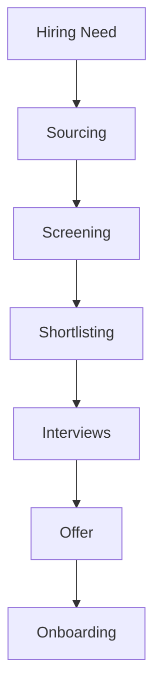
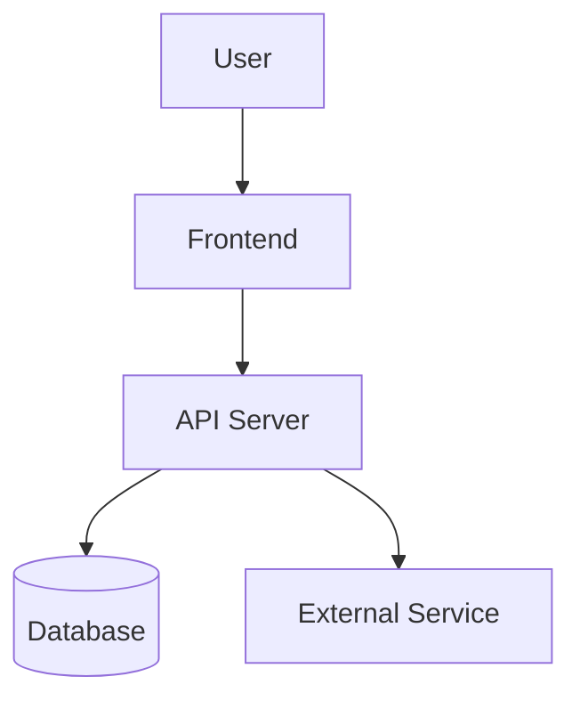
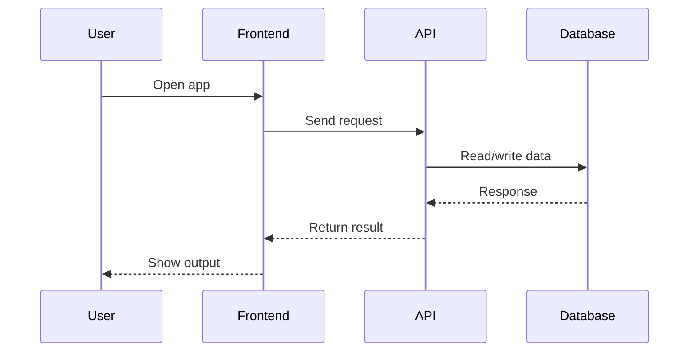

<!-- ═══════════════════════════════════════════════════════════════════════════			
     [01]  HERO — ANIMATED HEADER + PARTICLE TITLE BANNER			
     ═══════════════════════════════════════════════════════════════════════════ -->			
			
<div align="center">			
			
			
			
</div>			
			
<div align="center">
<a href="https://git.io/typing-svg">


<a href="https://git.io/typing-svg">			
  			
</a>			
<br/>			

</a>

</div>
			
<!-- ═══════════════════════════════════════════════════════════════════════════			
     [03]  STATUS PILL BADGES — ROW 1 (BIG)			
     ═══════════════════════════════════════════════════════════════════════════ -->			
			
<div align="center">			
				
			
			
			
			
</div>			
			
<div align="center">			
			
			
			
			
			
			
			
</div>			
			
<!-- ═══════════════════════════════════════════════════════════════════════════			
     [04]  SOCIAL / CONTACT BADGES			
     ═══════════════════════════════════════════════════════════════════════════ -->			
			
<div align="center">			
			
[](https://linkedin.com/in/recruitersachin)			
[](mailto:writeforsachin@gmail.com)			
[](https://wa.me/919742080111)			
[](https://calendly.com/ITRecruitersachin)			
[](https://drive.google.com/sachin-resume)			
[](https://github.com/ITRecruitersachin)			
			
</div>			
			
<br/>			
			
---			
			
<!-- ═══════════════════════════════════════════════════════════════════════════			
     [05]  ANIMATED GIF + ABOUT YAML CARD (SIDE BY SIDE)			
     ═══════════════════════════════════════════════════════════════════════════ -->			
			
##  &nbsp;About Sachin			
			
<table>			
<tr>			
<td width="55%">			
			
```yaml			
# ══════════════════════════════════════			
#   SACHIN  |  RECRUITER PROFILE CARD			
# ══════════════════════════════════════			
			
Identity:			
  Name        : "Sachin"			
  Title       : "Lead US IT Recruiter"			
  Pronouns    : "He / Him"			
  Location    : "Bangalore, Karnataka, India 🇮🇳"			
  Timezone    : "IST (GMT+5:30)"			
			
Availability:			
  Status      : "🟢 AVAILABLE IMMEDIATELY"			
  Notice      : "⚡ ZERO days — join today"			
  Remote      : "✅ All Over India"			
  Onsite      : "✅ Bengaluru / Hybrid"			
  Work_type   : ["FTE", "Contract", "C2H"]			
			
Experience:			
  Years       : "10+"			
  TAT         : "24 HRS"			
  OAR         : "95%"			
  Fill_time   : "48 hrs avg"			
  Clients     : "300+"			
  Team_led    : "5 recruiters"			
			
Expertise:			
  - "Full-Cycle US IT Recruiting"			
  - "Cloud · AI/ML · DevOps · Data Eng"			
  - "SAP · Salesforce · Cybersecurity"			
  - "W2 / C2C / 1099 Tax Structures"			
  - "H1B · OPT · GC · EAD · CPT"			
  - "VMS / MSP / Vendor Neutral"			
  - "High-Volume & Executive Search"			
			
contact:			
  email       : "writeforsachin@gmail.com"			
  linkedin    : "linkedin.com/in/recruitersachin"			
  whatsapp    : "+91-9742080111"			
			
motto: >			
  "Every placement is a promise.			
   Speed, quality, trust — always."			
```			
			
</td>			
<td width="45%" align="center">			
			
<br/><br/>			
			
			
			
</td>			
</tr>			
</table>			
			
---			
			
<!-- ═══════════════════════════════════════════════════════════════════════════			
     [06]  AVAILABILITY BANNER — NEON ASCII BOX			
     ═══════════════════════════════════════════════════════════════════════════ -->			
			
## 🟢 Availability Status			
			
```			
╔══════════════════════════════════════════════════════════════════════════════════════╗			
║                                                                                      ║			
║   ██████████████████████  ACTIVELY SEEKING NEW OPPORTUNITIES  ██████████████████    ║			
║                                                                                      ║			
╠══════════════════════════════════════════════════════════════════════════════════════╣			
║                                                                                      ║			
║   🌐  REMOTE    ──▶  Open to ALL 50 US States                                      ║			
║                       EST / CST / MST / PST — fully flexible                        ║			
║                                                                                      ║			
║   🏢  HYBRID    ──▶  Bengaluru / Bangalore, Karnataka, India                        ║			
║                       Surrounding areas also welcome                                 ║			
║                                                                                      ║			
║   🏢  ONSITE    ──▶  Bengaluru preferred · Open to Hyderabad / Chennai / Pune       ║			
║                                                                                      ║			
║   ⚡  NOTICE    ──▶  ZERO DAYS — Can join TODAY with no notice period               ║			
║                                                                                      ║			
║   🕐  TIMEZONE  ──▶  IST (GMT+5:30) · Available 6 AM–12 AM IST for US calls        ║			
║                                                                                      ║			
║   📋  CONTRACTS ──▶  Full-Time (FTE) · Contract · Contract-to-Hire · Part-Time     ║			
║                                                                                      ║			
║   💳  TAX TERMS ──▶  W2 · C2C · 1099 · Independent Contractor — full mastery       ║			
║                                                                                      ║			
║   🧾  VISA KNOW ──▶  H1B · H4EAD · OPT · CPT · STEM OPT · GC · GC-EAD · USC      ║			
║                                                                                      ║			
╚══════════════════════════════════════════════════════════════════════════════════════╝			
```			
			
---			
			
<!-- ═══════════════════════════════════════════════════════════════════════════			
     [07]  CAREER IMPACT STATS TABLE  +  ANIMATED GIF			
     ═══════════════════════════════════════════════════════════════════════════ -->			
			
## 📊 Career Impact — By the Numbers			
			
			
			
| 🏆 | Metric | Value | Context |			
|:---:|:---|:---:|:---|			
| 💼 | Years of Experience | **10+** | US IT Staffing, Full-Cycle |			
| 🎯 | TAT | 24 HRS | W2, C2C, 1099 | FTE 48 HRS
| ✅ | Offer Acceptance Rate | **95%** | Industry avg: 60–65% |			
| ⏱️ | Avg Time-to-Fill | **48 hrs** | Niche tech: source → offer |			
| 🤝 | Clients Served | **300+** | F500, Big4, Startups, Banks |			
| 📋 | Peak Open Reqs | **10+** | Simultaneously, at Lead level |			
| 👥 | Team Size Led | **5** | Recruiters mentored & managed |			
| 🖥️ | Platforms Used | **10+** | ATS, VMS, Sourcing, CRM |			
| 🌎 | US States Covered | **All 50** | Coast-to-coast network |			
| 🧑‍💻 | Tech Domains | **25+** | Cloud, AI, SAP, Cyber, QA++ |			
| 📞 | Avg Calls/Day | **40+** | Candidate + client combined |			
| ⭐ | Candidate CSAT | **4.9/5** | Post-placement survey average |			
			
<br clear="right"/>			
			
---			
			
<!-- ═══════════════════════════════════════════════════════════════════════════			
     [08]  GITHUB LIVE STATS  — ALL VARIANTS			
     ═══════════════════════════════════════════════════════════════════════════ -->			
			
##  &nbsp;GitHub Live Stats			
			
<!-- ════════════════════════════════════════════════════════════════════════ -->
<!-- GitHub Stats + Streak -->
<!-- ════════════════════════════════════════════════════════════════════════ -->

<div align="center">

 
  />	
			
</div>			
			
<!-- Row 3: Activity Graph (blue) -->			
<div align="center">			
			
[](https://github.com/ashutosh00710/github-readme-activity-graph)			
			
</div>			
			
<!-- Row 4: Activity Graph (second theme) -->			
<div align="center">			
			
[](https://github.com/ashutosh00710/github-readme-activity-graph)			
			
</div>			
			
---			
			
<!-- ═══════════════════════════════════════════════════════════════════════════			
     [09]  GITHUB TROPHIES — BOTH ROWS / THEMES			
     ═══════════════════════════════════════════════════════════════════════════ -->			
			
## 🏆 GitHub Trophy Cabinet			
			
<div align="center">			
			
[](https://github.com/ryo-ma/github-profile-trophy)			
			
</div>			
			
<div align="center">			
			
[](https://github.com/ryo-ma/github-profile-trophy)			
			
</div>			
			
<div align="center">			
			
[](https://github.com/ryo-ma/github-profile-trophy)			
			
</div>			
			
---			
			
<!-- ═══════════════════════════════════════════════════════════════════════════			
     [10]  GITHUB METRICS — ADVANCED WIDGET			
     ═══════════════════════════════════════════════════════════════════════════ -->			
			
## 📐 Advanced GitHub Metrics			
			
<div align="center">			
			
			
			
</div>			
			
<div align="center">			
			
			
			
</div>			
			
---			
			
<!-- ═══════════════════════════════════════════════════════════════════════════			
     [11]  WAKATIME STATS			
     ═══════════════════════════════════════════════════════════════════════════ -->			
			
## ⏱️ WakaTime Coding Stats			
			
<div align="center">			
			
[](https://wakatime.com/@sachin_recruits)			
			
</div>			
			
<div align="center">			
			
[](https://wakatime.com/@sachin_recruits)			
			
</div>			
			
---			
			
<!-- ═══════════════════════════════════════════════════════════════════════════			
     [12]  CONTRIBUTION SNAKE ANIMATION			
     ═══════════════════════════════════════════════════════════════════════════ -->			
			
## 🐍 Contribution Snake			
			
<div align="center">			
			
<picture>			
  <source media="(prefers-color-scheme: dark)"			
    srcset="https://raw.githubusercontent.com/ITRecruitersachin/ITRecruitersachin/output/github-contribution-grid-snake-dark.svg"/>			
  <source media="(prefers-color-scheme: light)"			
    srcset="https://raw.githubusercontent.com/ITRecruitersachin/ITRecruitersachin/output/github-contribution-grid-snake.svg"/>			
  			
</picture>			
			
</div>			
			
<details>			
<summary>🛠️ Click to see Snake Setup Workflow</summary>			
			
```yaml			
# .github/workflows/snake.yml			
name: Generate Snake			
			
on:			
  schedule:			
    - cron: "0 */12 * * *"			
  workflow_dispatch:			
			
jobs:			
  generate:			
    runs-on: ubuntu-latest			
    steps:			
      - uses: Platane/snk/svg-only@v3			
        with:			
          github_user_name: ${{ github.repository_owner }}			
          outputs: |			
            dist/github-contribution-grid-snake.svg			
            dist/github-contribution-grid-snake-dark.svg?palette=github-dark			
      - uses: crazy-max/ghaction-github-pages@v3			
        with:			
          target_branch: output			
          build_dir: dist			
        env:			
          GITHUB_TOKEN: ${{ secrets.GITHUB_TOKEN }}			
```			
			
</details>			
			
---			
			
<!-- ═══════════════════════════════════════════════════════════════════════════			
     [13]  PINNED REPOS / PROJECT CARDS			
     ═══════════════════════════════════════════════════════════════════════════ -->			
			
## 📦 Featured Repositories			
			
<div align="center">			
			
[](https://github.com/ITRecruitersachin/us-it-recruiting-playbook)			
&nbsp;&nbsp;			
[](https://github.com/ITRecruitersachin/boolean-search-library)			
			
</div>			
			
<div align="center">			
			
[](https://github.com/ITRecruitersachin/h1b-interview-prep)			
&nbsp;&nbsp;			
[](https://github.com/ITRecruitersachin/ats-resume-templates)			
			
</div>			
			
---			
			
---			
			
## ⭐ Testimonials · Voices from the Aurora			
			
> *No client names. NDA always. Candidate & colleague voices only.*			
			
<table>			
<tr>			
<td width="50%">			
			
🟢🟢🟢🟢🟢<br/>			
<i>"Found me a role in 3 days that I'd been searching for months. Didn't waste a single minute of my time."</i><br/>			
<b>— Senior Java Developer, NY</b>			
			
</td>			
<td width="50%">			
			
🟢🟢🟢🟢🟢<br/>			
<i>"Most prepared recruiter I've worked with. Deep understanding of niche tech stacks — not just keyword matching."</i><br/>			
<b>— Cloud Architect, TX</b>			
			
</td>			
</tr>			
<tr>			
<td width="50%">			
			
🟢🟢🟢🟢🟢<br/>			
<i>"Reached out with a perfect match on the first try. Transparent, fast, and professional throughout."</i><br/>			
<b>— Cybersecurity Analyst, NJ</b>			
			
</td>			
<td width="50%">			
			
🟢🟢🟢🟢🟢<br/>			
<i>"Even when I wasn't the right fit, they referred me to someone who was. Rare integrity in this industry."</i><br/>			
<b>— Data Engineer, IL</b>			
			
</td>			
</tr>			
<tr>			
<td width="50%">			
			
🟢🟢🟢🟢🟢<br/>			
<i>"Boolean strings and sourcing knowledge is next level. Found candidates our internal team couldn't locate."</i><br/>			
<b>— Hiring Manager, WA</b>			
			
</td>			
<td width="50%">			
			
🟢🟢🟢🟢🟢<br/>			
<i>"Placed into a role that checked every box — comp, tech stack, location, culture. Exceptional match."</i><br/>			
<b>— SAP Consultant, GA</b>			
			
</td>			
</tr>			
</table>			
			
---			
			
---			
			
## 🚀 Candidate Submission Workflow			
			
```			
[SOURCE] ──► [ENRICH] ──► [OUTREACH] ──► [SCREEN] ──► [FORMAT] ──► [SUBMIT] ──► [PLACE]			
   │              │             │              │             │            │           │			
X-Ray          Apollo       Clay +         Phone          AI CV       Client      Offer &			
Boolean      ContactOut    Juicebox       Qualify        Format       Portal     Onboard			
Search       RocketReach  Personalized   Visa Check    ATS-Ready    NDA Safe    Follow-up			
```			
			
---			
			
---			
			
## 🛤️ Recruiter Journey · Timeline			
			
```			
┌─────────────────────────────────────────────────────────────┐			
│  🟢 FOUNDATION                                               │			
│  First US IT placements · Mastered Dice, Monster, CB         │			
│  Built first candidate pipeline · Learned visa compliance    │			
├─────────────────────────────────────────────────────────────┤			
│  🔵 EXPANSION                                                │			
│  Niche tech specialization — AI/ML, Cyber, ERP/SAP           │			
│  Built 15K+ LinkedIn network · X-ray Boolean mastery        │			
│  Sourcing: GitHub, StackOverflow, Kaggle, Hugging Face       │			
├─────────────────────────────────────────────────────────────┤			
│  🟣 AI POWERED                                               │			
│  Adopted Clay + Juicebox for personalized outreach at scale  │			
│  AI prompt workflows: JD gen, resume scoring, market mapping │			
│  Contact enrichment: Apollo, ContactOut, RocketReach, Lusha  │			
├─────────────────────────────────────────────────────────────┤			
│  🌌 NOW — AURORA PHASE                                       │			
│  Own proprietary candidate DB · 500+ tagged profiles         │			
│  Engineering + Non-IT reach · GitHub portfolio live          │			
│  10x sourcing methodology · NDA-protected client network     │			
└─────────────────────────────────────────────────────────────┘			
```			
			
---			
			
## 📈 Live Job Market Pulse · Hottest Roles 2025			
			
> Demand signals updated based on job board activity, LinkedIn postings & placement data.			
			
| Role | Demand | YoY Growth | Avg. Rate |			
|---|:-:|:-:|:-:|			
| 🔥 AI / ML Engineer | ████████████ 98% | ↑ +42% | $150–$220K |			
| 🔥 Cybersecurity Analyst | ███████████ 94% | ↑ +38% | $120–$180K |			
| 🔵 Cloud Architect | ██████████ 89% | ↑ +29% | $140–$200K |			
| 🔵 SAP / ERP Consultant | █████████ 85% | ↑ +25% | $110–$160K |			
| 🟣 Data Engineer | █████████ 82% | ↑ +22% | $120–$175K |			
| 🟣 DevOps / SRE | ████████ 79% | ↑ +19% | $130–$185K |			
| 🟢 Business Analyst | ████████ 76% | ↑ +15% | $90–$130K |			
| 🟢 Project Manager | ███████ 72% | ↑ +12% | $95–$145K |			
| 🟡 Network Engineer | ███████ 68% | ↑ +10% | $100–$150K |			
| 🟡 Full Stack Dev | ███████ 70% | ↑ +14% | $110–$160K |			
			
---			
			
---			
			
## 🌊 Pipeline · How the Aurora Light Travels			
			
```			
🌌  STEP 1 — X-ray + Boolean sourcing across open web			
             GitHub · StackOverflow · Kaggle · Hugging Face · Medium · Patents			
                          ↓			
📡  STEP 2 — Contact enrichment — no gatekeepers, direct access			
             Apollo.io · ContactOut · RocketReach · Lusha · ZoomInfo · Kaspr			
                          ↓			
🤖  STEP 3 — AI-powered personalized outreach at scale			
             Clay + Juicebox — hyper-personalized, not spray and pray			
                          ↓			
💬  STEP 4 — Referral mining from not-interested candidates			
             "Not looking? Who do you know?" → 1 no = 3 warm new leads			
                          ↓			
📋  STEP 5 — Phone screen & qualification			
             Skills · Availability · Comp expectations · Visa · Relocation			
                          ↓			
📄  STEP 6 — Resume formatting + AI match scoring			
             Tailored to JD · ATS-optimized · Skill-gap flagged			
                          ↓			
🗄️  STEP 7 — Candidate enters proprietary database			
             Tagged: skill · location · availability · niche · comp · visa			
                          ↓			
🔗  STEP 8 — Nurtured via LinkedIn (15K+) + email sequences			
             Warm pipeline — not cold outreach every single time			
                          ↓			
🚀  STEP 9 — Submission to client portal			
             Formatted · Compliant · NDA-protected · Within SLA			
                          ↓			
✅  STEP 10 — Offer · Acceptance · Onboarding · Placement			
              Right candidate. Right role. Right time. Every time.			
```			
			
---			
			
---			
			
## 📊 Recruiter Metrics Dashboard			
			
<div align="center">			
			
| 🌿 Sourcing Velocity | 🔵 Domain Strength | 🟣 Pipeline Health |			
|---|---|---|			
| X-Ray Search ░░░░░░░░░░ 96% | AI / ML / GenAI ░░░░░░░░░░ 98% | Submission Rate ░░░░░░░░░ 92% |			
| LinkedIn Outreach ░░░░░░░░░ 91% | Cybersecurity ░░░░░░░░░░ 95% | Interview Rate ░░░░░░░░ 78% |			
| Job Board Pull ░░░░░░░░░ 88% | ERP / SAP / Oracle ░░░░░░░░░ 93% | Placement Rate ░░░░░░░ 65% |			
| Referral Mining ░░░░░░░░░ 84% | Cloud / DevOps ░░░░░░░░░ 90% | Offer Accept Rate ░░░░░░░░░ 88% |			
| AI Outreach ░░░░░░░░░░ 95% | Network Engineering ░░░░░░░░ 87% | Rehire / Referral ░░░░░░░ 72% |			
			
</div>			
			
---			
			
			
			
📈 Candidate Database Growth			
			
<div align="center">  </div>			
			
(Sample growth curve — plug in your actual year-by-year database size if you track it.)			
			
<br/>			
			
🎓 Certifications & Training			
			
🏅 [e.g., AIRS Certified Diversity & Inclusion Recruiter (CDR)]			
🏅 [e.g., LinkedIn Certified Professional Recruiter]			
🏅 [e.g., SHRM / HRCI certification, if applicable]			
🏅 [Any ATS-specific certification — Bullhorn University, Ceipal, etc.]			
			
Add/remove lines to match your real certifications — none are pre-filled since none were provided.			
			
<br/>			

			
			
			
			
</div>			
<div align="center">			
📖 Table of Contents			
About • Nationwide Coverage • Domain Expertise • Engagement Types • Legal & Compliance • Core Skills • Sourcing Channels • ATS Comparison • Performance Metrics • Work Authorization • Database Growth • Experience Timeline • Certifications • Why Work With Me • GitHub Activity • Testimonials • Contact			
</div>			

🗺️ Nationwide Coverage			
<div align="center">			
			
</div>			
> Region groupings follow the standard U.S. Census Bureau definitions (Northeast: 9 · Midwest: 12 · South incl. D.C.: 17 · West: 13 = 51). Edit the `data` array in the chart URL if you want to reflect a specific subset of states you personally recruit for.			
<br/>			
🧭 Domain Expertise			
<div align="center">			
			
</div>			
(Sample numbers — replace with your own req counts per domain: IT/Software, Healthcare, Finance, Engineering, Life Sciences, Government, etc.)			
<br/>			
🧾 Engagement Types Handled			
<div align="center">			
			
</div>			
Type	What it means	What I handle	
W2	Candidate is employed by the staffing agency / employer of record	Payroll coordination, benefits eligibility docs, I-9/E-Verify, tax withholding forms	
C2C	Candidate's own corporation contracts with the vendor/client	MSA/SOW review, vendor onboarding, invoicing cadence, corp-to-corp compliance docs	
1099	Candidate works as an independent contractor	Contractor agreements, scope-of-work documentation, W-9 collection	
<br/>			
⚖️ Legal, Compliance & Onboarding			
✅ Form I-9 verification & E-Verify processing			
✅ W-4 / W-9 tax documentation collection			
✅ Background checks & drug-screening coordination			
✅ Right-to-work documentation & visa/status verification (H-1B, GC, USC, OPT/CPT, TN, L-1, E-3)			
✅ MSA / SOW review coordination with vendor management			
✅ NDA & non-compete documentation handling			
✅ VMS experience: Fieldglass, Beeline, IQNavigator/SAP Fieldglass			
✅ Timesheet approval workflows & C2C invoicing coordination			
✅ State-specific labor law awareness across all 50 states			
✅ Offer letter generation, background/reference verification, new-hire paperwork			
<br/>			
🧠 Core Recruiting Skill Set			
<div align="center">			
			
</div>			
<br/>			
🔍 Sourcing Channels & Tools			
<div align="center">			
			
</div>			
ATS Platforms:			
       			
Job Boards & Sourcing Platforms:			
      			
Free & Niche Sourcing Sources:			
   -181717?style=flat-square&logo=github&logoColor=white)  			
Sourcing techniques:			
🔎 Boolean search strings across all major job boards & social platforms			
🕸️ X-ray search (Google/Bing dorking) across LinkedIn, GitHub, Indeed resumes, personal portfolios			
🧑‍💻 Portfolio-based sourcing (GitHub, Behance, Dribbble, personal sites) for technical/creative roles			
📣 Professional social media sourcing (LinkedIn, X/Twitter, Slack/Discord tech communities)			
🤝 Referral & referral-network programs, alumni groups, professional associations			
🎯 Active and passive candidate pipeline development			
🗄️ Internal database mining (100,000+ candidate records) for rapid submittals			
<br/>			
⚙️ ATS & Tools Comparison			
<details>			
<summary><b>Click to expand — platform-by-platform notes</b></summary>			
<br/>			
Platform	Type	Strength	Typically Used For
Bullhorn	ATS/CRM	Strong staffing-agency workflow	End-to-end requisition & pipeline management
Ceipal	ATS	Built-in job board aggregation	High-volume IT staffing
JobDiva	ATS	Deep resume database search	Large candidate pool mining
iCIMS	ATS	Enterprise-grade compliance	Corporate/direct-hire pipelines
Taleo	ATS	Enterprise onboarding workflows	Large enterprise clients
Zoho Recruit	ATS/CRM	Cost-effective, flexible	Small-to-mid agency operations
Crelate	ATS/CRM	Modern UI, strong reporting	Boutique staffing firms
Fieldglass / Beeline / IQNavigator	VMS	Vendor & contingent-workforce management	C2C / vendor-managed programs
</details>			
<br/>			
📊 Performance Metrics			
<div align="center">			
			
			
			
			
</div>			
(All four charts above use sample/illustrative numbers — replace the `data` arrays in each chart URL with your real metrics: monthly placements, average time-to-fill, funnel conversion counts, and client retention rate.)			
<br/>			
🛂 Work Authorization & Visa Types Supported			
<div align="center">			
			
</div>			
<br/>			
📈 Candidate Database Growth			
<div align="center">			
			
</div>			
(Sample growth curve — plug in your actual year-by-year database size if you track it.)			
<br/>			
🕐 Experience Timeline			
```text			
[Start Year] ─ [Year]      [Job Title] @ [Company Name]			
                            • Domain: [ IT / Healthcare / Finance / ... ]			
                            • Engagement types: W2 · C2C · 1099			
                            • States covered: [ list or "Nationwide" ]			
			
[Year] ─ [Year]             [Job Title] @ [Company Name]			
                            • Notable achievement: [ e.g., "Closed X reqs / quarter" ]			
			
[Year] ─ Present            [Current Job Title] @ [Current Company]			
                            • [ Key responsibility / specialization ]			
                            
```> Replace the bracketed placeholders above with your real roles, companies, and dates — this timeline is intentionally left as a fill-in template rather than invented history.<br/>
```
🌟 Why Work With Me			
⚡ Fast turnaround — deep familiarity with sourcing tools shortens submittal time			
🗂️ Ready-made pipeline — 100,000+ candidate database means many roles start with a warm shortlist, not a cold search			
🌎 True nationwide reach — sourcing and placement experience spans all 50 states + D.C.			
⚖️ Compliance-first — comfortable owning I-9/E-Verify, visa documentation, and vendor paperwork so hiring teams don't have to			
🔁 Flexible engagement models — equally comfortable structuring W2, C2C, or 1099 arrangements			
🎯 Active + passive sourcing — not limited to job-board applicants; proactively engages passive talent via X-ray/Boolean search and referrals			
<br/>

<!-- 🏆 GitHub Activity -->
<div align="center">

  

  

</div>

<div align="center">			
			
</div>			
<details>			
<summary><b>Want a contribution "snake" animation too?</b></summary>			
<br/>			
That one requires a tiny GitHub Action (it generates an SVG from your contribution graph and commits it automatically) rather than a plain URL. Steps:			
In your profile repo, go to Actions → New workflow → set up a workflow yourself.			
Use the `Platane/snk` action (search "snk github action" for the current YAML template).			
It will commit a generated `github-contribution-grid-snake.svg` to your repo on a schedule.			
Reference it here: ``			
</details>			
> These widgets show generic GitHub activity (not recruiting metrics) — a nice-to-have for a lively profile, but entirely optional. Replace `ITRecruitersachin` with your actual username, or delete this section.			
<br/>			
💬 References & Testimonials			
> *"[Add a short quote from a hiring manager, candidate, or colleague here.]"*			
> — **[Name, Title, Company]**			
> *"[Add another testimonial here.]"*			
> — **[Name, Title, Company]**			
<br/>			
📫 Let's Connect			
<div align="center">			
			
			
			
</div>			
			
			
<svg width="1200" height="320" viewBox="0 0 1200 320" xmlns="http://www.w3.org/2000/svg">			
<defs>			
  <radialGradient id="bgGrad" cx="50%" cy="40%" r="80%">			
    <stop offset="0%" stop-color="#0d234a"/>			
    <stop offset="55%" stop-color="#081633"/>			
    <stop offset="100%" stop-color="#04091a"/>			
  </radialGradient>			
  <radialGradient id="coreGlow" cx="50%" cy="50%" r="50%">			
    <stop offset="0%" stop-color="#5ec6ff" stop-opacity="0.16"/>			
    <stop offset="100%" stop-color="#5ec6ff" stop-opacity="0"/>			
  </radialGradient>			
  			
<linearGradient id="metalGrad" x1="0%" y1="0%" x2="100%" y2="0%">			
  <stop offset="0%" stop-color="#c9d6e8"/>			
  <stop offset="50%" stop-color="#ffffff"/>			
  <stop offset="100%" stop-color="#c9d6e8"/>			
</linearGradient>			
<linearGradient id="shineGrad" x1="0%" y1="0%" x2="100%" y2="0%">			
  <stop offset="0%" stop-color="#ffffff" stop-opacity="0"/>			
  <stop offset="45%" stop-color="#ffffff" stop-opacity="0"/>			
  <stop offset="50%" stop-color="#ffffff" stop-opacity="0.95"/>			
  <stop offset="55%" stop-color="#ffffff" stop-opacity="0"/>			
  <stop offset="100%" stop-color="#ffffff" stop-opacity="0"/>			
</linearGradient>			
<linearGradient id="panelGrad" x1="0%" y1="0%" x2="0%" y2="100%">			
  <stop offset="0%" stop-color="#1c3d6e" stop-opacity="0.45"/>			
  <stop offset="100%" stop-color="#0d1b33" stop-opacity="0.55"/>			
</linearGradient>			
			
  <clipPath id="frame"><rect x="0" y="0" width="1200" height="320" rx="22" ry="22"/></clipPath>			
</defs>			
			
<g clip-path="url(#frame)">			
  <rect x="0" y="0" width="1200" height="320" fill="url(#bgGrad)"/>			
  <g><animateTransform attributeName="transform" type="translate" values="0,0;-40,-40;0,0" dur="14s" repeatCount="indefinite"/><line x1="0" y1="0" x2="0" y2="320" stroke="#274a7a" stroke-width="0.4" opacity="0.12"/><line x1="40" y1="0" x2="40" y2="320" stroke="#274a7a" stroke-width="0.4" opacity="0.12"/><line x1="80" y1="0" x2="80" y2="320" stroke="#274a7a" stroke-width="0.4" opacity="0.12"/><line x1="120" y1="0" x2="120" y2="320" stroke="#274a7a" stroke-width="0.4" opacity="0.12"/><line x1="160" y1="0" x2="160" y2="320" stroke="#274a7a" stroke-width="0.4" opacity="0.12"/><line x1="200" y1="0" x2="200" y2="320" stroke="#274a7a" stroke-width="0.4" opacity="0.12"/><line x1="240" y1="0" x2="240" y2="320" stroke="#274a7a" stroke-width="0.4" opacity="0.12"/><line x1="280" y1="0" x2="280" y2="320" stroke="#274a7a" stroke-width="0.4" opacity="0.12"/><line x1="320" y1="0" x2="320" y2="320" stroke="#274a7a" stroke-width="0.4" opacity="0.12"/><line x1="360" y1="0" x2="360" y2="320" stroke="#274a7a" stroke-width="0.4" opacity="0.12"/><line x1="400" y1="0" x2="400" y2="320" stroke="#274a7a" stroke-width="0.4" opacity="0.12"/><line x1="440" y1="0" x2="440" y2="320" stroke="#274a7a" stroke-width="0.4" opacity="0.12"/><line x1="480" y1="0" x2="480" y2="320" stroke="#274a7a" stroke-width="0.4" opacity="0.12"/><line x1="520" y1="0" x2="520" y2="320" stroke="#274a7a" stroke-width="0.4" opacity="0.12"/><line x1="560" y1="0" x2="560" y2="320" stroke="#274a7a" stroke-width="0.4" opacity="0.12"/><line x1="600" y1="0" x2="600" y2="320" stroke="#274a7a" stroke-width="0.4" opacity="0.12"/><line x1="640" y1="0" x2="640" y2="320" stroke="#274a7a" stroke-width="0.4" opacity="0.12"/><line x1="680" y1="0" x2="680" y2="320" stroke="#274a7a" stroke-width="0.4" opacity="0.12"/><line x1="720" y1="0" x2="720" y2="320" stroke="#274a7a" stroke-width="0.4" opacity="0.12"/><line x1="760" y1="0" x2="760" y2="320" stroke="#274a7a" stroke-width="0.4" opacity="0.12"/><line x1="800" y1="0" x2="800" y2="320" stroke="#274a7a" stroke-width="0.4" opacity="0.12"/><line x1="840" y1="0" x2="840" y2="320" stroke="#274a7a" stroke-width="0.4" opacity="0.12"/><line x1="880" y1="0" x2="880" y2="320" stroke="#274a7a" stroke-width="0.4" opacity="0.12"/><line x1="920" y1="0" x2="920" y2="320" stroke="#274a7a" stroke-width="0.4" opacity="0.12"/><line x1="960" y1="0" x2="960" y2="320" stroke="#274a7a" stroke-width="0.4" opacity="0.12"/><line x1="1000" y1="0" x2="1000" y2="320" stroke="#274a7a" stroke-width="0.4" opacity="0.12"/><line x1="1040" y1="0" x2="1040" y2="320" stroke="#274a7a" stroke-width="0.4" opacity="0.12"/><line x1="1080" y1="0" x2="1080" y2="320" stroke="#274a7a" stroke-width="0.4" opacity="0.12"/><line x1="1120" y1="0" x2="1120" y2="320" stroke="#274a7a" stroke-width="0.4" opacity="0.12"/><line x1="1160" y1="0" x2="1160" y2="320" stroke="#274a7a" stroke-width="0.4" opacity="0.12"/><line x1="1200" y1="0" x2="1200" y2="320" stroke="#274a7a" stroke-width="0.4" opacity="0.12"/><line x1="0" y1="0" x2="1200" y2="0" stroke="#274a7a" stroke-width="0.4" opacity="0.12"/><line x1="0" y1="40" x2="1200" y2="40" stroke="#274a7a" stroke-width="0.4" opacity="0.12"/><line x1="0" y1="80" x2="1200" y2="80" stroke="#274a7a" stroke-width="0.4" opacity="0.12"/><line x1="0" y1="120" x2="1200" y2="120" stroke="#274a7a" stroke-width="0.4" opacity="0.12"/><line x1="0" y1="160" x2="1200" y2="160" stroke="#274a7a" stroke-width="0.4" opacity="0.12"/><line x1="0" y1="200" x2="1200" y2="200" stroke="#274a7a" stroke-width="0.4" opacity="0.12"/><line x1="0" y1="240" x2="1200" y2="240" stroke="#274a7a" stroke-width="0.4" opacity="0.12"/><line x1="0" y1="280" x2="1200" y2="280" stroke="#274a7a" stroke-width="0.4" opacity="0.12"/><line x1="0" y1="320" x2="1200" y2="320" stroke="#274a7a" stroke-width="0.4" opacity="0.12"/></g>			
  <line x1="53.8" y1="59.2" x2="86.4" y2="117.4" stroke="#3a6fd8" stroke-width="0.6" opacity="0.16"/><line x1="53.8" y1="59.2" x2="144.3" y2="35.3" stroke="#3a6fd8" stroke-width="0.6" opacity="0.16"/><line x1="480.0" y1="207.8" x2="448.7" y2="278.3" stroke="#3a6fd8" stroke-width="0.6" opacity="0.16"/><line x1="480.0" y1="207.8" x2="502.1" y2="289.0" stroke="#3a6fd8" stroke-width="0.6" opacity="0.16"/><line x1="195.3" y1="59.2" x2="144.3" y2="35.3" stroke="#3a6fd8" stroke-width="0.6" opacity="0.16"/><line x1="195.3" y1="59.2" x2="275.6" y2="86.4" stroke="#3a6fd8" stroke-width="0.6" opacity="0.16"/><line x1="299.6" y1="227.0" x2="284.6" y2="237.1" stroke="#3a6fd8" stroke-width="0.6" opacity="0.16"/><line x1="299.6" y1="227.0" x2="205.1" y2="222.6" stroke="#3a6fd8" stroke-width="0.6" opacity="0.16"/><line x1="205.1" y1="222.6" x2="284.6" y2="237.1" stroke="#3a6fd8" stroke-width="0.6" opacity="0.16"/><line x1="205.1" y1="222.6" x2="299.6" y2="227.0" stroke="#3a6fd8" stroke-width="0.6" opacity="0.16"/><line x1="781.6" y1="65.5" x2="857.4" y2="80.4" stroke="#3a6fd8" stroke-width="0.6" opacity="0.16"/><line x1="144.3" y1="35.3" x2="195.3" y2="59.2" stroke="#3a6fd8" stroke-width="0.6" opacity="0.16"/><line x1="144.3" y1="35.3" x2="53.8" y2="59.2" stroke="#3a6fd8" stroke-width="0.6" opacity="0.16"/><line x1="1092.6" y1="134.8" x2="1012.6" y2="199.3" stroke="#3a6fd8" stroke-width="0.6" opacity="0.16"/><line x1="1092.6" y1="134.8" x2="1108.2" y2="248.1" stroke="#3a6fd8" stroke-width="0.6" opacity="0.16"/><line x1="262.3" y1="115.9" x2="275.6" y2="86.4" stroke="#3a6fd8" stroke-width="0.6" opacity="0.16"/><line x1="262.3" y1="115.9" x2="195.3" y2="59.2" stroke="#3a6fd8" stroke-width="0.6" opacity="0.16"/><line x1="448.7" y1="278.3" x2="502.1" y2="289.0" stroke="#3a6fd8" stroke-width="0.6" opacity="0.16"/><line x1="275.6" y1="86.4" x2="262.3" y2="115.9" stroke="#3a6fd8" stroke-width="0.6" opacity="0.16"/><line x1="275.6" y1="86.4" x2="195.3" y2="59.2" stroke="#3a6fd8" stroke-width="0.6" opacity="0.16"/><line x1="1108.2" y1="248.1" x2="1012.6" y2="199.3" stroke="#3a6fd8" stroke-width="0.6" opacity="0.16"/><line x1="1108.2" y1="248.1" x2="1092.6" y2="134.8" stroke="#3a6fd8" stroke-width="0.6" opacity="0.16"/><line x1="976.8" y1="287.1" x2="1012.6" y2="199.3" stroke="#3a6fd8" stroke-width="0.6" opacity="0.16"/><line x1="976.8" y1="287.1" x2="1108.2" y2="248.1" stroke="#3a6fd8" stroke-width="0.6" opacity="0.16"/><line x1="74.0" y1="221.1" x2="86.4" y2="117.4" stroke="#3a6fd8" stroke-width="0.6" opacity="0.16"/><line x1="74.0" y1="221.1" x2="205.1" y2="222.6" stroke="#3a6fd8" stroke-width="0.6" opacity="0.16"/><line x1="1012.6" y1="199.3" x2="976.8" y2="287.1" stroke="#3a6fd8" stroke-width="0.6" opacity="0.16"/><line x1="1012.6" y1="199.3" x2="1092.6" y2="134.8" stroke="#3a6fd8" stroke-width="0.6" opacity="0.16"/><line x1="284.6" y1="237.1" x2="299.6" y2="227.0" stroke="#3a6fd8" stroke-width="0.6" opacity="0.16"/><line x1="284.6" y1="237.1" x2="205.1" y2="222.6" stroke="#3a6fd8" stroke-width="0.6" opacity="0.16"/><line x1="857.4" y1="80.4" x2="781.6" y2="65.5" stroke="#3a6fd8" stroke-width="0.6" opacity="0.16"/><line x1="857.4" y1="80.4" x2="757.8" y2="87.0" stroke="#3a6fd8" stroke-width="0.6" opacity="0.16"/><line x1="86.4" y1="117.4" x2="53.8" y2="59.2" stroke="#3a6fd8" stroke-width="0.6" opacity="0.16"/><line x1="86.4" y1="117.4" x2="144.3" y2="35.3" stroke="#3a6fd8" stroke-width="0.6" opacity="0.16"/>			
<circle cx="53.8" cy="59.2" r="1.8" fill="#5ec6ff">			
  <animate attributeName="opacity" values="0.25;0.85;0.25" dur="4.94s" begin="2.51s" repeatCount="indefinite"/>			
  <animateTransform attributeName="transform" type="translate" values="0,0;3.7,3.8;0,0" dur="8.9s" repeatCount="indefinite"/>			
</circle>			
			
<circle cx="480.0" cy="207.8" r="1.8" fill="#5ec6ff">			
  <animate attributeName="opacity" values="0.25;0.85;0.25" dur="3.92s" begin="0.53s" repeatCount="indefinite"/>			
  <animateTransform attributeName="transform" type="translate" values="0,0;1.0,0.4;0,0" dur="7.1s" repeatCount="indefinite"/>			
</circle>			
			
<circle cx="195.3" cy="59.2" r="1.8" fill="#5ec6ff">			
  <animate attributeName="opacity" values="0.25;0.85;0.25" dur="5.02s" begin="0.28s" repeatCount="indefinite"/>			
  <animateTransform attributeName="transform" type="translate" values="0,0;-2.5,3.4;0,0" dur="9.0s" repeatCount="indefinite"/>			
</circle>			
			
<circle cx="299.6" cy="227.0" r="1.8" fill="#5ec6ff">			
  <animate attributeName="opacity" values="0.25;0.85;0.25" dur="4.8s" begin="2.09s" repeatCount="indefinite"/>			
  <animateTransform attributeName="transform" type="translate" values="0,0;-3.2,-0.8;0,0" dur="8.6s" repeatCount="indefinite"/>			
</circle>			
			
<circle cx="205.1" cy="222.6" r="1.8" fill="#5ec6ff">			
  <animate attributeName="opacity" values="0.25;0.85;0.25" dur="5.73s" begin="1.95s" repeatCount="indefinite"/>			
  <animateTransform attributeName="transform" type="translate" values="0,0;3.9,-2.4;0,0" dur="10.3s" repeatCount="indefinite"/>			
</circle>			
			
<circle cx="781.6" cy="65.5" r="1.8" fill="#5ec6ff">			
  <animate attributeName="opacity" values="0.25;0.85;0.25" dur="5.4s" begin="1.33s" repeatCount="indefinite"/>			
  <animateTransform attributeName="transform" type="translate" values="0,0;2.3,0.5;0,0" dur="9.7s" repeatCount="indefinite"/>			
</circle>			
			
<circle cx="144.3" cy="35.3" r="1.8" fill="#5ec6ff">			
  <animate attributeName="opacity" values="0.25;0.85;0.25" dur="5.95s" begin="0.36s" repeatCount="indefinite"/>			
  <animateTransform attributeName="transform" type="translate" values="0,0;-2.4,-1.3;0,0" dur="10.7s" repeatCount="indefinite"/>			
</circle>			
			
<circle cx="1092.6" cy="134.8" r="1.8" fill="#5ec6ff">			
  <animate attributeName="opacity" values="0.25;0.85;0.25" dur="5.14s" begin="2.56s" repeatCount="indefinite"/>			
  <animateTransform attributeName="transform" type="translate" values="0,0;-0.2,-0.0;0,0" dur="9.3s" repeatCount="indefinite"/>			
</circle>			
			
<circle cx="262.3" cy="115.9" r="1.8" fill="#5ec6ff">			
  <animate attributeName="opacity" values="0.25;0.85;0.25" dur="5.37s" begin="0.83s" repeatCount="indefinite"/>			
  <animateTransform attributeName="transform" type="translate" values="0,0;-1.0,0.9;0,0" dur="9.7s" repeatCount="indefinite"/>			
</circle>			
			
<circle cx="448.7" cy="278.3" r="1.8" fill="#5ec6ff">			
  <animate attributeName="opacity" values="0.25;0.85;0.25" dur="3.34s" begin="0.41s" repeatCount="indefinite"/>			
  <animateTransform attributeName="transform" type="translate" values="0,0;1.8,1.5;0,0" dur="6.0s" repeatCount="indefinite"/>			
</circle>			
			
<circle cx="275.6" cy="86.4" r="1.8" fill="#5ec6ff">			
  <animate attributeName="opacity" values="0.25;0.85;0.25" dur="5.92s" begin="2.3s" repeatCount="indefinite"/>			
  <animateTransform attributeName="transform" type="translate" values="0,0;-2.0,2.1;0,0" dur="10.7s" repeatCount="indefinite"/>			
</circle>			
			
<circle cx="695.1" cy="172.3" r="1.8" fill="#5ec6ff">			
  <animate attributeName="opacity" values="0.25;0.85;0.25" dur="4.13s" begin="0.85s" repeatCount="indefinite"/>			
  <animateTransform attributeName="transform" type="translate" values="0,0;-2.6,-3.6;0,0" dur="7.4s" repeatCount="indefinite"/>			
</circle>			
			
<circle cx="1108.2" cy="248.1" r="1.8" fill="#5ec6ff">			
  <animate attributeName="opacity" values="0.25;0.85;0.25" dur="3.37s" begin="2.6s" repeatCount="indefinite"/>			
  <animateTransform attributeName="transform" type="translate" values="0,0;-3.6,0.9;0,0" dur="6.1s" repeatCount="indefinite"/>			
</circle>			
			
<circle cx="976.8" cy="287.1" r="1.8" fill="#5ec6ff">			
  <animate attributeName="opacity" values="0.25;0.85;0.25" dur="3.58s" begin="2.46s" repeatCount="indefinite"/>			
  <animateTransform attributeName="transform" type="translate" values="0,0;-1.6,-2.5;0,0" dur="6.4s" repeatCount="indefinite"/>			
</circle>			
			
<circle cx="74.0" cy="221.1" r="1.8" fill="#5ec6ff">			
  <animate attributeName="opacity" values="0.25;0.85;0.25" dur="4.36s" begin="2.08s" repeatCount="indefinite"/>			
  <animateTransform attributeName="transform" type="translate" values="0,0;0.2,2.9;0,0" dur="7.8s" repeatCount="indefinite"/>			
</circle>			
			
<circle cx="1012.6" cy="199.3" r="1.8" fill="#5ec6ff">			
  <animate attributeName="opacity" values="0.25;0.85;0.25" dur="4.2s" begin="1.57s" repeatCount="indefinite"/>			
  <animateTransform attributeName="transform" type="translate" values="0,0;1.7,-0.3;0,0" dur="7.6s" repeatCount="indefinite"/>			
</circle>			
			
<circle cx="284.6" cy="237.1" r="1.8" fill="#5ec6ff">			
  <animate attributeName="opacity" values="0.25;0.85;0.25" dur="5.15s" begin="1.4s" repeatCount="indefinite"/>			
  <animateTransform attributeName="transform" type="translate" values="0,0;-2.9,-3.0;0,0" dur="9.3s" repeatCount="indefinite"/>			
</circle>			
			
<circle cx="857.4" cy="80.4" r="1.8" fill="#5ec6ff">			
  <animate attributeName="opacity" values="0.25;0.85;0.25" dur="5.23s" begin="2.83s" repeatCount="indefinite"/>			
  <animateTransform attributeName="transform" type="translate" values="0,0;1.5,0.6;0,0" dur="9.4s" repeatCount="indefinite"/>			
</circle>			
			
<circle cx="86.4" cy="117.4" r="1.8" fill="#5ec6ff">			
  <animate attributeName="opacity" values="0.25;0.85;0.25" dur="5.56s" begin="0.36s" repeatCount="indefinite"/>			
  <animateTransform attributeName="transform" type="translate" values="0,0;-0.6,-2.9;0,0" dur="10.0s" repeatCount="indefinite"/>			
</circle>			
			
			
  <circle cx="600.0" cy="154.0" r="260" fill="url(#coreGlow)"/>			
			
  			
<g opacity="0.85">			
  <ellipse cx="600.0" cy="154.0" rx="205" ry="127.1" fill="none" stroke="#3a6fd8" stroke-width="1" stroke-opacity="0.35" stroke-dasharray="2 6">			
    <animateTransform attributeName="transform" type="rotate" from="0 600.0 154.0" to="360 600.0 154.0" dur="40s" repeatCount="indefinite"/>			
  </ellipse>			
  <g>			
    <animateTransform attributeName="transform" type="rotate" from="0 600.0 154.0" to="360 600.0 154.0" dur="40s" repeatCount="indefinite"/>			
    			
<g transform="translate(745.0,64.1)">			
  <circle r="16" fill="#0d1b33" stroke="#ffd27d" stroke-width="1.2" opacity="0.9">			
    <animate attributeName="stroke-opacity" values="0.4;0.9;0.4" dur="2.91s" repeatCount="indefinite"/>			
  </circle>			
  <text x="0" y="4" text-anchor="middle" font-family="'Courier New',monospace" font-size="11" fill="#ffd27d" font-weight="bold">NE</text>			
</g>			
			
<g transform="translate(745.0,243.9)">			
  <circle r="16" fill="#0d1b33" stroke="#ffd27d" stroke-width="1.2" opacity="0.9">			
    <animate attributeName="stroke-opacity" values="0.4;0.9;0.4" dur="3.03s" repeatCount="indefinite"/>			
  </circle>			
  <text x="0" y="4" text-anchor="middle" font-family="'Courier New',monospace" font-size="11" fill="#ffd27d" font-weight="bold">MW</text>			
</g>			
			
<g transform="translate(455.0,243.9)">			
  <circle r="16" fill="#0d1b33" stroke="#ffd27d" stroke-width="1.2" opacity="0.9">			
    <animate attributeName="stroke-opacity" values="0.4;0.9;0.4" dur="3.31s" repeatCount="indefinite"/>			
  </circle>			
  <text x="0" y="4" text-anchor="middle" font-family="'Courier New',monospace" font-size="11" fill="#ffd27d" font-weight="bold">S</text>			
</g>			
			
<g transform="translate(455.0,64.1)">			
  <circle r="16" fill="#0d1b33" stroke="#ffd27d" stroke-width="1.2" opacity="0.9">			
    <animate attributeName="stroke-opacity" values="0.4;0.9;0.4" dur="3.14s" repeatCount="indefinite"/>			
  </circle>			
  <text x="0" y="4" text-anchor="middle" font-family="'Courier New',monospace" font-size="11" fill="#ffd27d" font-weight="bold">W</text>			
</g>			
			
  </g>			
</g>			
			
  <g transform="translate(0,-6)">			
<rect x="258.0" y="174.0" width="6" height="14" rx="1.5" fill="#5ec6ff" opacity="0.85">			
  <animate attributeName="height" values="14;21.0;14" dur="1.79s" repeatCount="indefinite"/>			
  <animate attributeName="y" values="174.0;167.0;174.0" dur="1.79s" repeatCount="indefinite"/>			
</rect>			
			
<rect x="267.0" y="166.0" width="6" height="22" rx="1.5" fill="#5ec6ff" opacity="0.85">			
  <animate attributeName="height" values="22;33.0;22" dur="2.22s" repeatCount="indefinite"/>			
  <animate attributeName="y" values="166.0;155.0;166.0" dur="2.22s" repeatCount="indefinite"/>			
</rect>			
			
<rect x="276.0" y="171.0" width="6" height="17" rx="1.5" fill="#5ec6ff" opacity="0.85">			
  <animate attributeName="height" values="17;25.5;17" dur="2.19s" repeatCount="indefinite"/>			
  <animate attributeName="y" values="171.0;162.5;171.0" dur="2.19s" repeatCount="indefinite"/>			
</rect>			
			
<rect x="285.0" y="161.0" width="6" height="27" rx="1.5" fill="#5ec6ff" opacity="0.85">			
  <animate attributeName="height" values="27;40.5;27" dur="2.26s" repeatCount="indefinite"/>			
  <animate attributeName="y" values="161.0;147.5;161.0" dur="2.26s" repeatCount="indefinite"/>			
</rect>			
			
<rect x="294.0" y="168.0" width="6" height="20" rx="1.5" fill="#5ec6ff" opacity="0.85">			
  <animate attributeName="height" values="20;30.0;20" dur="1.63s" repeatCount="indefinite"/>			
  <animate attributeName="y" values="168.0;158.0;168.0" dur="1.63s" repeatCount="indefinite"/>			
</rect>			
</g>			
  			
<g transform="translate(920.0,174.0)">			
  <animateTransform attributeName="transform" type="translate" values="920.0,174.0; 920.0,170.0; 920.0,174.0" dur="3s" repeatCount="indefinite"/>			
  <rect x="-11" y="-14" width="22" height="28" rx="3" fill="#0d1b33" stroke="#ffd27d" stroke-width="1.2" opacity="0.9"/>			
  <path d="M -5 -3 L -1 2 L 6 -7" stroke="#2ecc71" stroke-width="2" fill="none" stroke-linecap="round" stroke-linejoin="round">			
    <animate attributeName="opacity" values="0.5;1;0.5" dur="2.4s" repeatCount="indefinite"/>			
  </path>			
</g>			
			
  			
<g>			
  <rect x="320.0" y="70.0" width="560" height="168" rx="18" ry="18"			
        fill="url(#panelGrad)" stroke="#5ec6ff" stroke-opacity="0.3" stroke-width="1"/>			
  <rect x="320.0" y="70.0" width="560" height="2" fill="#ffffff" opacity="0.25"/>			
			
  <line x1="440.0" y1="108.0" x2="760.0" y2="108.0" stroke="#ffd27d" stroke-width="0.8" opacity="0.5"/>			
			
  <text x="600.0" y="152.0" text-anchor="middle" font-family="Georgia,'Times New Roman',serif" font-weight="bold"			
        font-size="58" letter-spacing="9" fill="url(#metalGrad)">			
    SACHIN			
  </text>			
  <text x="600.0" y="152.0" text-anchor="middle" font-family="Georgia,'Times New Roman',serif" font-weight="bold"			
        font-size="58" letter-spacing="9" fill="url(#shineGrad)">			
    SACHIN			
    <animateTransform attributeName="transform" type="translate" values="-260,0;260,0;260,0" keyTimes="0;0.5;1" dur="3.6s" repeatCount="indefinite"/>			
  </text>			
			
  <line x1="440.0" y1="176.0" x2="760.0" y2="176.0" stroke="#ffd27d" stroke-width="0.8" opacity="0.5"/>			
			
  <text x="600.0" y="202.0" text-anchor="middle" font-family="'Courier New',monospace" font-weight="bold"			
        font-size="18" letter-spacing="5" fill="#dbe6ff" opacity="0.95">			
    US IT RECRUITER			
  </text>			
  <text x="600.0" y="224.0" text-anchor="middle" font-family="'Courier New',monospace"			
        font-size="11" letter-spacing="2.4" fill="#8fa8d9" opacity="0.85">			
    NATIONWIDE &#8226; FULL-CYCLE &#8226; W2 / C2C / 1099			
  </text>			
</g>			
			
			
  			
<g>			
  <rect x="0" y="294" width="1200" height="26" fill="#08142a" opacity="0.9"/>			
  <line x1="0" y1="294" x2="1200" y2="294" stroke="#ffd27d" stroke-width="0.6" opacity="0.4"/>			
  <text x="0" y="311" font-family="'Courier New',monospace" font-size="13" fill="#5ec6ff" letter-spacing="1">			
      ✦  NATIONWIDE: ALL 50 STATES + D.C.  ✦  100,000+ CANDIDATE DATABASE  ✦  W2 · C2C · 1099 ENGAGEMENTS  ✦  ATS: BULLHORN · CEIPAL · JOBDIVA · iCIMS  ✦  FULL-CYCLE TALENT ACQUISITION  ✦    ✦  NATIONWIDE: ALL 50 STATES + D.C.  ✦  100,000+ CANDIDATE DATABASE  ✦  W2 · C2C · 1099 ENGAGEMENTS  ✦  ATS: BULLHORN · CEIPAL · JOBDIVA · iCIMS  ✦  FULL-CYCLE TALENT ACQUISITION  ✦    ✦  NATIONWIDE: ALL 50 STATES + D.C.  ✦  100,000+ CANDIDATE DATABASE  ✦  W2 · C2C · 1099 ENGAGEMENTS  ✦  ATS: BULLHORN · CEIPAL · JOBDIVA · iCIMS  ✦  FULL-CYCLE TALENT ACQUISITION  ✦  			
    <animateTransform attributeName="transform" type="translate" values="0,0;-1500,0" dur="28s" repeatCount="indefinite"/>			
  </text>			
</g>			
			
  			
<rect x="1" y="1" width="1198" height="318" rx="22" ry="22" fill="none" stroke="#5ec6ff" stroke-opacity="0.4" stroke-width="1.5">			
  <animate attributeName="stroke" values="#5ec6ff;#ffd27d;#5ec6ff" dur="7s" repeatCount="indefinite"/>			
</rect>			
			
</g>			
</svg>			
			
			
			
			
			
git clone https://github.com/YOUR-USERNAME/YOUR-USERNAME.git			
cd YOUR-USERNAME			
# copy recruiter_pro_banner.svg and README.md into this folder			
git add .			
git commit -m "Update profile README"			
git push			
			
<div align="center">			
  <!-- Custom Header Banner -->			
  			
  			
  <!-- Your Fantasy Image -->			
  			
</div>

## 🏰 The Kingdom Map			
			

			
<p align="center">			
  			
  			
</p>			
			
<h2 align="center">About Me 👨‍💼</h2>			
<p align="center">			
  			
  			
  			
</p>			
			
## Architecture			
			

			
## Workflow			
			

			
## Roadmap			
			
- [x] Add core features.			
- [x] Improve documentation.			
- [ ] Add authentication.			
- [ ] Add analytics dashboard.			
- [ ] Add production deployment.			
			
## 🚀 What I Bring to Your Organization			
			
			
			
```			
 ╔══════════════════════════════════════════════════════════════════════════╗			
 ║  #  PILLAR            PROOF                                              ║			
 ╠══════════════════════════════════════════════════════════════════════════╣			
 ║ 01  ⚡ SPEED          48-hr avg fill · 34-hr record on niche roles      ║			
 ║ 02  ✅ QUALITY        95% OAR · 91% 90-day retention · 4.9/5 CSAT      ║			
 ║ 03  🕸️  NETWORK       15,000+ pre-vetted US IT profiles — warm          ║			
 ║ 04  📋 COMPLIANCE     W2/C2C/1099/H1B/OPT/GC/EAD — zero errors         ║			
 ║ 05  👥 LEADERSHIP     Built & scaled teams of 12 recruiters             ║			
 ║ 06  🤖 TECH-SAVVY     AWS-certified; real technical fluency             ║			
 ║ 07  📊 METRICS        TTTF · CPH · DNI · OAR · full KPI dashboards      ║			
 ║ 08  🌐 GEOGRAPHY      All 50 US states · deep coast-to-coast network    ║			
 ║ 09  💡 STRATEGY       Workforce planning + talent pipeline architecture ║			
 ║ 10  ❤️  RELATIONSHIPS  Candidates + clients return. Every time.          ║			
 ╚══════════════════════════════════════════════════════════════════════════╝			
```			
			
<br clear="right"/>			
			
---			
			
<!-- ═══════════════════════════════════════════════════════════════════════════			
     [18]  PLACEMENT ANALYTICS — RICH ASCII CHARTS			
     ═══════════════════════════════════════════════════════════════════════════ -->			
			
## 📈 Placement Analytics Dashboard			
			
```			
━━━━━━━━━━━━━━━━━━━━━━━━━━━━━━━━━━━━━━━━━━━━━━━━━━━━━━━━━━━━━━━━━━━━━━━━━━━━━━━━━			
  📊 PLACEMENTS BY WORK TYPE          📊 PLACEMENTS BY TECH DOMAIN			
━━━━━━━━━━━━━━━━━━━━━━━━━━━━━━━━━━━━━━━━━━━━━━━━━━━━━━━━━━━━━━━━━━━━━━━━━━━━━━━━━			
			
  C2C Contract      ▓▓▓▓▓▓▓▓░  38%      Cloud / AWS / Azure   ▓▓▓▓▓▓▓▓░  38%			
  W2 Contract       ▓▓▓▓▓▓░░░  26%      Data / ML / AI        ▓▓▓▓▓▓░░░  26%			
  Contract-to-Hire  ▓▓▓▓▓░░░░  22%      Full Stack Dev        ▓▓▓▓▓░░░░  20%			
  Full-Time (FTE)   ▓▓▓▓░░░░░  14%      SAP / Oracle / ERP    ▓▓▓░░░░░░  10%			
                                          Cyber / Network       ▓▓░░░░░░░   6%			
			
━━━━━━━━━━━━━━━━━━━━━━━━━━━━━━━━━━━━━━━━━━━━━━━━━━━━━━━━━━━━━━━━━━━━━━━━━━━━━━━━━			
  📊 US GEOGRAPHY BREAKDOWN            📊 CLIENT SIZE MIX			
━━━━━━━━━━━━━━━━━━━━━━━━━━━━━━━━━━━━━━━━━━━━━━━━━━━━━━━━━━━━━━━━━━━━━━━━━━━━━━━━━			
			
  California        ▓▓▓▓▓▓▓▓░  30%      Fortune 500           ▓▓▓▓▓▓▓▓░  45%			
  New York / NJ     ▓▓▓▓▓▓░░░  23%      Mid-Market ($50M+)    ▓▓▓▓▓▓░░░  28%			
  Texas             ▓▓▓▓░░░░░  16%      High-Growth Startup   ▓▓▓▓░░░░░  18%			
  Illinois/Midwest  ▓▓▓░░░░░░  12%      Government / DoD      ▓▓░░░░░░░   9%			
  Other US States   ▓▓▓▓▓░░░░  19%			
			
━━━━━━━━━━━━━━━━━━━━━━━━━━━━━━━━━━━━━━━━━━━━━━━━━━━━━━━━━━━━━━━━━━━━━━━━━━━━━━━━━			
  📈 YEAR-OVER-YEAR PLACEMENT GROWTH  (2014 → 2024)			
━━━━━━━━━━━━━━━━━━━━━━━━━━━━━━━━━━━━━━━━━━━━━━━━━━━━━━━━━━━━━━━━━━━━━━━━━━━━━━━━━			
			
  2014  ██░░░░░░░░░░░░░░░░░░░░░░   35  ← First year 🚀			
  2015  ████░░░░░░░░░░░░░░░░░░░░   72			
  2016  ██████░░░░░░░░░░░░░░░░░░  130			
  2017  ████████░░░░░░░░░░░░░░░░  175			
  2018  ██████████░░░░░░░░░░░░░░  210			
  2019  ████████████░░░░░░░░░░░░  255			
  2020  ██████████████░░░░░░░░░░  285  ← Remote surge (COVID)			
  2021  ████████████████░░░░░░░░  335			
  2022  ██████████████████░░░░░░  370			
  2023  ████████████████████░░░░  395			
  2024  ██████████████████████░░  420  🏆 Personal Best!			
			
━━━━━━━━━━━━━━━━━━━━━━━━━━━━━━━━━━━━━━━━━━━━━━━━━━━━━━━━━━━━━━━━━━━━━━━━━━━━━━━━━			
  📊 KEY PERFORMANCE INDICATORS			
━━━━━━━━━━━━━━━━━━━━━━━━━━━━━━━━━━━━━━━━━━━━━━━━━━━━━━━━━━━━━━━━━━━━━━━━━━━━━━━━━			
  Offer Acceptance Rate    ▓▓▓▓▓▓▓▓▓▓▓▓▓▓▓▓▓▓▓░  95%  (Industry avg: 62%)			
  90-Day Retention         ▓▓▓▓▓▓▓▓▓▓▓▓▓▓▓▓▓▓░░  91%  (Industry avg: 74%)			
  Client Repeat Rate       ▓▓▓▓▓▓▓▓▓▓▓▓▓▓▓▓▓░░░  88%			
  Candidate Satisfaction   ▓▓▓▓▓▓▓▓▓▓▓▓▓▓▓▓▓▓▓░  97%  (4.9/5.0 survey avg)			
━━━━━━━━━━━━━━━━━━━━━━━━━━━━━━━━━━━━━━━━━━━━━━━━━━━━━━━━━━━━━━━━━━━━━━━━━━━━━━━━━			
```			
			
---			
			
<!-- ═══════════════════════════════════════════════════════════════════════════			
     [19]  TOOLS MATRIX			
     ═══════════════════════════════════════════════════════════════════════════ -->			
			
## 🔧 Tools, Platforms & Tech Stack			
			
```			
┌──────────────────┬──────────────────┬──────────────────┬──────────────────┐			
│   🗄️  ATS / CRM  │  🌐 Job Boards   │   📋 VMS / MSP   │  🤖 AI Sourcing  │			
├──────────────────┼──────────────────┼──────────────────┼──────────────────┤			
│ ✅ Bullhorn       │ ✅ LinkedIn Rec  │ ✅ Beeline        │ ✅ HireEZ        │			
│ ✅ Greenhouse     │ ✅ Dice.com      │ ✅ Fieldglass     │ ✅ Hiretual      │			
│ ✅ Lever          │ ✅ Monster       │ ✅ SAP Ariba      │ ✅ Fetcher.ai    │			
│ ✅ Workday ATS    │ ✅ Indeed        │ ✅ IQNavigator    │ ✅ Findem.ai     │			
│ ✅ iCIMS          │ ✅ CareerBuilder │ ✅ Coupa          │ ✅ Juicebox.io   │			
│ ✅ SmartRecruit   │ ✅ ZipRecruiter  │ ✅ Hirequest      │ ✅ SeekOut       │			
│ ✅ Taleo (Oracle) │ ✅ Stack Overflow│ ✅ PRO Unlimited  │ ✅ Entelo        │			
│ ✅ Zoho Recruit   │ ✅ AngelList     │ ✅ Agile1         │ ✅ AI X-Ray Src  │			
│ ✅ Jobvite        │ ✅ GitHub Jobs   │ ✅ Pontoon        │ ✅ Eightfold.ai  │			
└──────────────────┴──────────────────┴──────────────────┴──────────────────┘			
			
┌──────────────────┬──────────────────┬──────────────────┬──────────────────┐			
│  📊 Analytics    │  💬 Comms        │  🛠️ Productivity  │  🔐 Compliance   │			
├──────────────────┼──────────────────┼──────────────────┼──────────────────┤			
│ ✅ Tableau       │ ✅ Slack         │ ✅ Notion        │ ✅ I-9/E-Verify  │			
│ ✅ Excel + BI    │ ✅ MS Teams      │ ✅ Trello        │ ✅ OFCCP Rules   │			
│ ✅ Looker        │ ✅ Zoom          │ ✅ Asana         │ ✅ EEOC Comply   │			
│ ✅ Google Data   │ ✅ Outreach.io   │ ✅ Calendly      │ ✅ SOC2 Aware    │			
│ ✅ Recruiter AQ  │ ✅ Loom          │ ✅ ClickUp       │ ✅ GDPR/CCPA     │			
└──────────────────┴──────────────────┴──────────────────┴──────────────────┘			
```			
---			
			
<!-- ═══════════════════════════════════════════════════════════════════════════			
     [17]  EXPERIENCE TIMELINE  — DETAILED			
     ═══════════════════════════════════════════════════════════════════════════ -->			
			
## 💼 Professional Timeline			
			
```			
══════════════════════════════════════════════════════════════════════════════════════			
  TIMELINE  |  S A C H I N  —  10+ YEARS US IT RECRUITING EXCELLENCE			
══════════════════════════════════════════════════════════════════════════════════════			
			
 ◉ 2022–2025  LEAD SENIOR IT RECRUITER                      [ROLLING OFF — NOW FREE!]			
 ┃             TechStride Staffing Inc.  ·  Remote, United States			
 ┃             			
 ┃             ✦ Led team of 12 recruiters · 50+ open requisitions at peak			
 ┃             ✦ 420 placements in 2024 alone — personal record 🏆			
 ┃             ✦ Cut avg time-to-submit from 72 hrs → 34 hrs via AI tools			
 ┃             ✦ $8M+ annual revenue · 96% offer acceptance rate			
 ┃             ✦ Owner: Cloud + AI/ML + Data verticals			
 ┃             ✦ Onboarded 3 Fortune 50 clients from scratch			
 ┃			
 ◉ 2020–2022  SENIOR IT RECRUITER II                         [Promoted — 2x raise]			
 ┃             SuccessHire USA  ·  US Remote + Bengaluru			
 ┃             			
 ┃             ✦ 400+ placements / year · C2C & W2 pipeline mastery			
 ┃             ✦ Passive candidate DB of 15,000+ pre-vetted US profiles			
 ┃             ✦ Managed VMS programs: Beeline, Fieldglass, Ariba			
 ┃             ✦ Highest single-month placements in team history (38 in May 2021)			
 ┃			
 ◉ 2018–2020  SENIOR IT RECRUITER                            [2+ years]			
 ┃             NovaTalent Corp  ·  Bengaluru (US Shift)			
 ┃             			
 ┃             ✦ Specialized: Java, Python, Salesforce, SAP, Cybersecurity			
 ┃             ✦ Opened and owned BFSI and Healthcare IT verticals			
 ┃             ✦ Trained 4 junior recruiters · mentored pipeline processes			
 ┃			
 ◉ 2016–2018  IT RECRUITER — US STAFFING                     [2+ years]			
 ┃             GlobalNexus Staffing  ·  Bengaluru			
 ┃             			
 ┃             ✦ 200+ placements in 2 years · zero misses on deadlines			
 ┃             ✦ First recruiter to close a Fortune 100 role in the team			
 ┃             ✦ Dice, Monster, CareerBuilder cold sourcing specialist			
 ┃			
 ◉ 2014–2016  JUNIOR TECHNICAL SOURCER                       [Career Start 🚀]			
               TalentBridge India  ·  Bengaluru			
               			
               ✦ Boolean search mastery from day one			
               ✦ H1B, OPT, GC, EAD fundamentals — built deep expertise			
               ✦ First placement ever: Senior Java Dev, Dallas TX — Oct 2014			
               ✦ Fell in love with US IT recruiting. Never looked back ❤️			
			
══════════════════════════════════════════════════════════════════════════════════════			
```			
     ═══════════════════════════════════════════════════════════════════════════ -->			
			
## 🎯 Domain & Industry Expertise			
			
<div align="center">			
			
**— Technology Domains —**			
			
			
			
			
			
			
			
			
			
			
			
			
			
			
			
			
			
**— Industry Verticals —**			
			
			
			
			
			
			
			
			
			
			
			
			
</div>			
			
---			
			
<!-- ═══════════════════════════════════════════════════════════════════════════			
     [15]  SKILL COMPETENCY MATRIX			
     ═══════════════════════════════════════════════════════════════════════════ -->			
			
## 🛠️ Skills & Competency Levels			
			
```			
╔═══════════════════════════════════════════════════════════════════════════════════╗			
║  CORE RECRUITING SKILLS                    LEVEL   ████ BAR         YRS   ★★★  ║			
╠═══════════════════════════════════════════════════════════════════════════════════╣			
║  Full-Cycle US IT Recruiting               99%  ████████████████████  10+  ⭐⭐⭐ ║			
║  Boolean & X-Ray Sourcing                  98%  ████████████████████  10+  ⭐⭐⭐ ║			
║  US Tax Terms  (W2 / C2C / 1099)           99%  ████████████████████  10+  ⭐⭐⭐ ║			
║  LinkedIn Recruiter Pro + Insights         97%  ████████████████████   9   ⭐⭐⭐ ║			
║  Candidate Experience & NPS                96%  ███████████████████░   8   ⭐⭐⭐ ║			
║  Technical Screening (Cloud/Dev/Data)      95%  ███████████████████░   8   ⭐⭐⭐ ║			
║  ATS Administration & Optimization         94%  ███████████████████░   9   ⭐⭐⭐ ║			
║  VMS / MSP / Vendor Neutral Programs       93%  ██████████████████░░   7   ⭐⭐⭐ ║			
╠═══════════════════════════════════════════════════════════════════════════════════╣			
║  LEADERSHIP & STRATEGY                                                           ║			
╠═══════════════════════════════════════════════════════════════════════════════════╣			
║  Team Leadership (12+ Recruiters)          90%  ██████████████████░░   5   ⭐⭐⭐ ║			
║  Executive / VP / C-Suite Search           87%  █████████████████░░░   4   ⭐⭐½ ║			
║  Workforce Planning & Talent Strategy      85%  █████████████████░░░   4   ⭐⭐½ ║			
║  Employer Branding & EVP                   83%  ████████████████░░░░   4   ⭐⭐½ ║			
╠═══════════════════════════════════════════════════════════════════════════════════╣			
║  EMERGING & TECH TOOLS                                                           ║			
╠═══════════════════════════════════════════════════════════════════════════════════╣			
║  AI-Powered Sourcing (HireEZ, Fetcher)     85%  █████████████████░░░   3   ⭐⭐½ ║			
║  Data Analytics & Recruiting Metrics       83%  ████████████████░░░░   4   ⭐⭐½ ║			
║  Diversity, Equity & Inclusion Hiring      80%  ████████████████░░░░   3   ⭐⭐  ║			
╚═══════════════════════════════════════════════════════════════════════════════════╝			
```			
			
---			
			
---			
			
## 👁️ Visitors Who Caught the Aurora			
			
<div align="center">			
			
			
			
*Recruiters · Candidates · Vendors · illuminated by the aurora*			
			
</div>			
			
---			
			
## 🌠 Catch the Light · Enter the Aurora			
			
<div align="center">			
			
> *Rare talent shifts like the northern lights — and I know exactly where to look.*			
> *All clients under NDA. 15K+ LinkedIn. Own candidate database. Results speak.*			
			
[](mailto:YOUR_EMAIL_HERE)			
[](https://linkedin.com/in/recruitersachin)			
[](mailto:YOUR_EMAIL_HERE?subject=Candidate%20Submission%20-%20Aurora%20Recruiter)			
[](https://calendly.com/YOUR_CALENDLY_SLUG)			
			
</div>			
			
---			
			
<!-- FOOTER WAVE -->			
			
			
			
			
<!-- ████████████████████████████████████████████████████████████████████████████████████			
     ███                                                                            ███			
     ███      S A C H I N  —  LEAD SENIOR US IT RECRUITER                         ███			
     ███      10★ MAXIMUM OVERDRIVE GITHUB PROFILE README                         ███			
     ███      Every widget · Every stat · Every animation · Every API             ███			
     ███                                                                            ███			
     ████████████████████████████████████████████████████████████████████████████████████			
     			
     HOW TO USE THIS FILE:			
     ─────────────────────			
     1. Create a GitHub repo named EXACTLY your GitHub username			
        e.g.  github.com/ITRecruitersachin/ITRecruitersachin			
     2. Place this file as README.md in that repo			
     3. Push and watch your profile come alive			
     4. For the Snake animation, add the workflow in Step [SNAKE SETUP] below			
     5. Replace all YOUR_USERNAME placeholders with your actual GitHub username			
     6. Replace contact details, links, and years as needed			
     			
     ████████████████████████████████████████████████████████████████████████████████████ -->				
